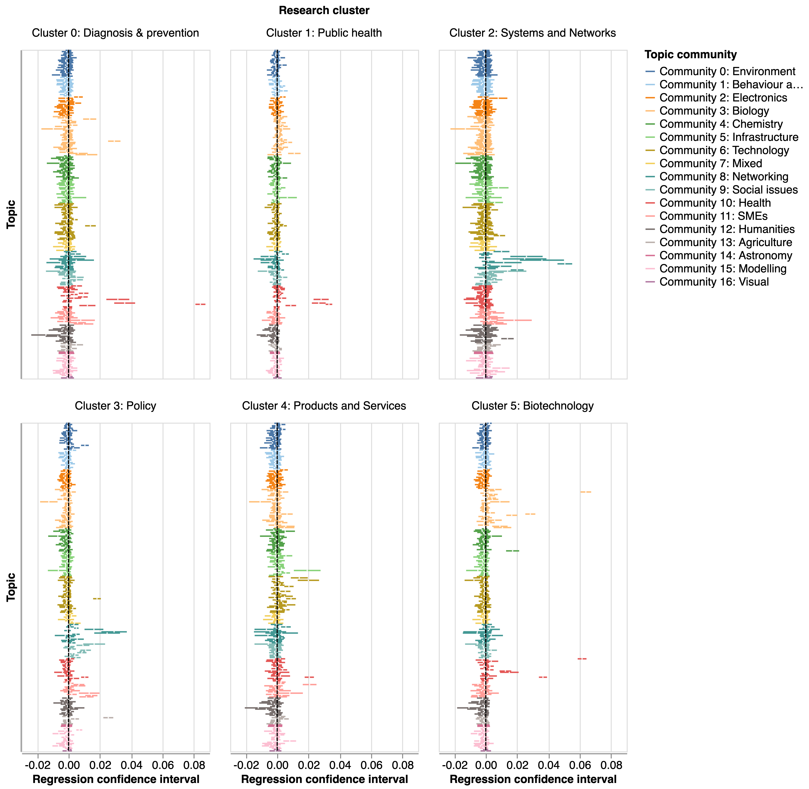

# EURITO internal validation reports

This note describes the methodology that we have used in the analysis of R&D activities in response to Covid-19 with a special focus on validation activities.

## 1. CORDIS

### Project clustering

We have analysed the Cordis dataset to gain a better understanding of the composition of the EC-funded response to Covid-19 and the extent to which it is linked to previous activities funded by the Commission. In order to do this, we need to find a way to quantify qualitative (textual) differences and similarities between projects. We use specter, a language model pre-trained on scientific abstracts which creates a vector representation of Cordis projects based on their abstracts. We can then analyse these vectors in order to find clusters, focusing  on a set of projects labelled by the Commission as part of the Covid-19 response.

One challenge with this is that clustering algorithms are initialised randomly so that the outputs can differ slightly across runs. The results also may vary depending on the parameters used to initialise the algorithms. For example, the K-means clustering algorithm takes the number of clusters in the data as a parameter and looks for partitions in the data with that number of clusters that maximise similarities inside groups and minimises similarities across groups. 

Since we do not have strong priors about the number of clusters in the data or about the shape of the clusters which might inform our decisions about these parametres, we adopt an ensemble approach where we take a group of clustering algorithms (KMeans, Affinity Propagation and Gaussian Mixtures) and range of parametres and apply them to our data (the vector representation of Covid-19 related projects funded by the Commission). We then build a network where the nodes are documents and the edges between them are the number of times that they are put in the same cluster by any given combination of clustering algorithm and parametre set. We then decompose this network into communities using a commumity detection algorithm that looks for a partition of the network that maximises its modularity. The resulting communities in the partition capture those groups of documents that are more robustly clustered together by our ensemble of algorithms.

In order to test the robustness of the outputs, we apply the community detection algorithm iteratively to our network and find that documents are put together in the same community 98% of the times, consistent with the idea that our outputs are robust to the choice of clustering algorithm and parametre set.

### Measuring similarities and differences

Having identified a set of clusters of Covid-19 related projects in the data, we are interested in measuring the similarity between other EC funded projects and this group. This has the goal of determining if countries participating in EC funded projects in an area before the pandemic were also more active afterwards. 

In order to do this we need to define a threshold for identifying projects which are 'similar' or 'disimilar' to a given cluster of Covid-19 related documents, and ensuring that our results are robust to that choice. 

We summarise each of our Covid-19 related clusters by calculating the median for the vectors representing these documents (the 'centroid' for those clusters) and measure the distance between all other documents and these centroids. The chart below shows the distribution of distances (note that the Y axis shows the density rather than number of documents in different categories).

 

The chart shows that there are some clusters with a clear separation between the documents in the labelled set and those outside, while others such as public health and policy have more overlap. One implication is that we need to take into account the shape of the distribution of distances for specific clusters when we try to identify documents similar to those in one of them.

In subsequent analysis, we use different similarity thresholds (based on standard deviations from mean distances to a cluster) in order to identify projects related to a cluster and calculate a country's relative specialisation (location quotient) in them. 

The chart below shows the resulting confidence intervals, which give us a sense of the robustness of the findings for different Covid-19 clusters and countries. As an example, the Covid-19 product and service oriented cluster has very wide confidence intervals suggesting that changes in the choice of threshold to determine if a project is similar to other projects in that cluster has a big impact on the results. By contrast, other clusters such as diagnosis and prevention and biotechnology have smaller confidence intervals, suggesting that our measures of national specialisation for them are more robust.

### Topic modelling

We are interested in understanding what topics are over / underrepresented in the EU response to Covid-19. In order to measure this, we fit a hierarchical topic model on all EC projects started after 2018. This yields a list of topics that are informative about the thematical composition of individual projects. We note that the hierarchical topic model strategy we follow is based on a generative model that finds the parametres that maximise the observed data while preventing overfitting, which is already conducive to robust results. 

The topic model yields a vector of probabilities with values that indicate if a topic is present in a corpus. In order to compare the prevalence of topics across different areas of research (based on the Covid-19 clusters identified above and a 'non-covid' category including all other projects) we regress topic weights on a categorical variable (the cluster that a project belongs to) using 'non-covid' as the baseline. 

This is the equivalent to comparing the distribution of weights for a topic in a Covid cluster with non-covid projects: positive values indicate overrepresentation and negative values indicate overrepresentation, while the estimated confidence intervals indicate the uncertainty of these estimates (see chart below for a visual representation), helping us to assess their robustneess.

### Organisational distance

## 2. Open science

We are interested in understanding Covid-19 related research trends and in particular the role that open science dissemination strategies and research might have played in the fight against the pandemic. In order to do this we have created a dataset that draws on the CORD19 dataset compiled by the Allen AI institute, and a pipeline to collect end enrich preprint data from arXiv, biorXiv and medrXiv, three popular preprints datasets. In order to do this we have:

* Identified all papers related to Covid-19 in a corpus of 1.8 million pre-prints.
* Removed from the CORD19 dataset any articles that do not mention any terms directly related to Covid-19, as well as (title) duplicates, as well as articles already present in our preprints corpus.

This yields a corpus of 250,000 papers, X of which were published after 2020.  

### Data source triangulation

#### National shares of activity

#### Temporal evolution

#### Topical comparison

### Research Paper clustering

### Research benchmarking

## 3. Open AIRE

