# Introduction

In EURITO (EU Relevant, Inclusive and Trusted Indicators) we explored the opportunities and challenges for developing indicators based on novel data sources and data science methods with the goal of informing Research and Innovation (R&I) policy. 

Our starting point was that the data revolution - increasing availability of a high volume of data generated at high velocity and with high variety, and of computational methods and tools to extract insights from it [@mayer2013big] - could generate a more detailed, timely and comprehensive view of the economy and its evolution which is relevant for R&I policymakers. Significant concerns around representativity, transparency and ethics are however standing in the way of their wider adoption [@bakhshi2016new]. 

We sought to tackle these issues by following a process that began with a scoping phase where we engaged policymakers to identify gaps in the R&I evidence base and indicator toolkit that could be addressed with new data and methods. We then explored opportunities to address those gaps through data science pilots and scaled up data collection and analysis in those areas that offered greatest promise / feasibility. The resulting indicators were validated qualitatively and quantitatively and distributed through reports and papers, open datasets and interactive visualisations. All our code was made openly available for others to inspect and build on.^[We have released code related to specific papers in individual github repositories. The [Eurito indicators repository](https://www.github.com/nesta_uk/eurito_indicators) contains the code used in the Covid-19 analysis and visualisation frontend.]

This final report describes our activities and outputs throughout the project with a focus on our indicator production methods and results. In those cases where these efforts have resulted in peer-reviewed publications, working papers or EURITO deliverables, we summarise key results and refer the readers to those documents for additional detail. In other cases - particularly the analysis of EU R&I funding data to measure activities related to Sustainable Development Goals, and our analysis of R&I activities related to Covid-19, we provide extensive information about the methods we used to produce and validate indicators.

[@sec:ind1] describes indicator development before Covid-19, This includes our policy scoping activities, the results of our exploratory pilots, our Artificial Intelligence (AI) mapping programme, and our analysis of relatedness to Sustainable Development Goals in a EU R&I funding corpus. 

[@sec:covid] presents the results of our analysis of a programme of research and indicator development about R&I activities related to Covid-19 initiated with the onset of the pandemic. This includes analyses of EU R&I funding data, preprints and peer-reviewed publications and outputs of research projects. 

[@sec:val] describes how we validated our indicators. 

[@sec:outputs] outlines the outputs of the project.

[@sec:org] discusses the organisational implications of our analysis: what activities are required to encourage the adoption of new indicators in the R&I evidence system, and what changes - in terms of capabilities, organisation and culture - are required if R&I agencies are going to realise the value of novel data sources and methods.

[@sec:conclusion] concludes.

# Indicator development before Covid-19 {#sec:ind1}

## Pilot related work and outputs {#subsec:pilots}

In the scoping phase of the project we organised two workshops in Brussels involving representatives from the European Commission, member states and the research and data community. These workshops were attended by XXX people. Our goal with them was to ensure that our indicator development activities were focused on policy-relevant areas, and to assess which features of R&I indicators might encourage or constrain their adoption. The workshops led to the identification of eight areas for further exploration through data science pilots. The detailed results of each pilot are available in **deliverable X** [TO_ADD]. In the list that follows we also indicate additional peer reviewed publications and working papers based on these pilots.

1. **Emerging technology ecosystems:** Here we analysed data about research funding, publications and startups to map activities related to emerging technologies with a case study focusing on Artificial Intelligence.
2. **Advanced research funding analytics:** We explored potential indicators capturing diversity, complexity and novelty in research with the goal of informing funding decisions. 
3. **Mission-driven innovation indicators:** We developed indicators about the level of activity in R&I missions with an application to the UK government mission to deploy Artificial Intelligence to improve the prevention, diagnisis and treatment of chronic diseases [@mateos2019mapping].
4. **Gender diversity in R&I workforce:** We explored the potential for using semantic analyses of researcher names in order to generate measures of diversity in R&I activities.
5. **Nowcasting R&D investment:** We assessed the feasibility of nowcasting R&D investment using timely web proxies.
6. **Technological transformations:** We developed methods to identify structural changes in technological fields with an application to the biofuel sector [@parraguez2020quantifying].
7. **Knowledge Flow:** We analysed the OpenAIRE database of research outputs to map networks of research collaboration and identify highly productive institutions and projects.
8. **Standards:** We investigated the potential use of data about standard adoption from the International Standards Organisation (ISO) and whether web data might be used to measure the adoption of standards in business [@mirtsch2020exploring].

Pilot results were discussed with policymakers in a follow-up event attended by XX people and an internal session with the Commission and we used the resulting feedback to select four areas to scale up with additional data collection and validation. These areas were:

1. Analysis of emerging technologies including levels of activity, changes in composition of activity and measures of diversity
2. Analysis of innovation activities related to sustainability
3. Use of advanced analytics to analyse research funnding and its impact
4. Nowcasting / triangulation of traditional innovation indicators with indicators emerging from the analyses above

In the rest of this section we summarise the results of the scaled-up analyses of emerging technologies (which became the EURITO AI mapping programme) and the results of our machine learning analysis to classify EC-funded research projects into the Sustainable Development Goals that they relate to. The Advanced Funding Analytics scale-up pivoted towards an analysis of the R&I response to Covid-19 with results that we present in [@sec:covid]. 

## AI research mapping programme {#subsec:ai}

Our AI mapping programme of work built on ideas and methods developed in the pilots about emerging technologies and technological transformation with the goal of developing indicators about levels of activity in AI research, its evolution composition and geography, and diversity in its workforce and the technologies that are explored. 

This research agenda was informed by the perception of a 'geopolitical race' in AI research and concerns about corporate dominance over its trajectory with potentially negative repercussions for equality, fairness and sustainability [@cave2018ai, @bender2021dangers]. In order to address it, we developed a data pipeline that automatically collects and enrichs data about preprints (a widely used channel for the dissemination of AI research) with information about participating institutions and their geography (see [@klinger2021deep] for additional details) and implemented semantic analysis methods to identify AI papers and particular techniques in the resulting corpus. This programme of work yielded the following outputs:

1. **Deep Learning, Deep Change** [@klinger2021deep]: In this paper we analysed preprint's abstracts in order to identify documents related to Deep Learning (DL), a computational technique that has played a central role in recent advances in AI research. Having done this, we analysed to which extent deep learning papers displayed the features of a General Purpose Technology (GPT) in computer science research [@bresnahan1995general], its geography and the local drivers of the emergence of deep learning research clusters. Our analysis supports the idea that deep learning research "behaves like a GPT", with growing levels of activity, diffusion into many different areas of computer science, and overrepresentation amongst highly cited works wherever it is adopted. We also evidenced the emergence of China as an 'AI superpower', with rapid growth in activity and relative specialisation in deep learning research. Finally, we incorporated into our analysis data about technology company activity from CrunchBase, a startup database in order to study the extent to which co-location between deep learning research clusters and industrial activities in related sectors contribute to the development of competitive deep learning clusters. The results of this investigation support the idea that DL research clusters benefit from proximity to industry clusters that provide opportunities for deployment and follow-up innovation. 
2. **Gender diversity in AI research** [@stathoulopoulos2019gender]. Here, we analysed the same corpus that we had developed for *Deep Learning, Deep Change* with the goal of measuring levels of gender diversity in AI research and its evolution, differences across countries and fields and the degree to which research involving more female AI researcher focuses on different topics compared to less diverse AI research efforts. Our analysis confirmed the existence of a persistent 'gender gap' in AI research: only around a quarter of papers involve at least one female researcher, and only around 12% of AI researchers are female. Rather concerningly, female participation in AI research has barely increased since the 1990s in relative terms. We also detect important differences between fields and countries in their level of female participation in AI research. More specifically, applied areas like health as well as research about the social impacts of AI tend to have a higher degree of female involvement while computer science and machine learning disciplines have less diversity. Nordic countries and the Netherlands tend to have more female participation in AI research than countries in Eastern Europe. 
3. **A Narrowing of AI research**[@klinger2020narrowing]. In this paper we analyse the evolution of the composition of AI research and its link with increasing corporate participation and influence in the field. This work is motivated by the idea that powerful deep learning techniques favoured by large technology companies are close to becoming the "dominant design" in AI research, and that this could be a source of concern given increasing evidence about the limitations of these techniques and their risks for fairness and sustainability [@marcus2018deep, @bender2021dangers]. In order to conduct our analysis, we deploy topic modelling methods that allow us to quantify the composition of AI research and use the outputs to calculate measures of thematic diversity derived from the economics, environmental science and innovation studies literature [@stirling2007general, @weitzman1992diversity, @page20101]. Our analysis suggests that there has been stagnation and even decline in the thematic diversity of AI research as deep learning techniques able to analyse large volumes of unstructured data come into the scene. We also show that the research profiles of private sector companies with high levels of participation of AI research are thematically narrower than research in academia, suggesting that the private sector might be playing a role in the loss of diversity in AI research.

Together, these analyses illustrate the potential of novel semantic methods and diversity metrics for shedding light on the trajectory of AI R&D and its dynamics, and to inform R&I policies to mitigate its risks for inclusion and sustainability thus ensuring that this powerful technology evolves in a direction that maximises its public benefits. The pipelines that we have developed also yield a collection of indicators about levels of AI and deep learning research activity and about the level of adoption of AI methods in Covid-19 related research (a topic we come back to in [@sec:covid].

## Sustainable Development Goal Modelling {#sec:sdg}

# Covid-19 R&D response {#sec:covid}

The Covid-19 pandemic has a complex relationship with R&I: on the one hand, it has elicited a massive R&D&I response culminating in the creation of effective vaccines. On the other, it has impacted on how science itself is conducted, creating a digital shift in scientific collaboration and communication and the wider adoption of open modes for dissemination of results, data and software code [@paunov2020science]. 

In this section we present the results of our own analysis of research funding and publication activities connected with Covid-19, which we have undertaken as part of a 'pandemic pivot'. 

This began with a short consultation round with EC policymakers where we identified several areas where semantic methods could add value to those indicators that are already available. 

We go through them in turn, describing the context for our research, the methods we used, the indicators we developed and their interpretation.

## CORDIS analysis {#sec:cordis}

We begin with an analysis of the European Commission funded response to Covid-19 under the rubric of the Horizon 2020 Framework Programme using the CORDIS open grant dataset, which includes information about H2020 funded projects and the organisations participating in them.^[We recognise that this does not capture all EC contributions to the R&I fight against the pandemic, for example through the activities of the European Research Council and EC contributions to the [Innovative Medicines Initiative](https://www.imi.europa.eu/apply-funding/closed-calls/imi2-call-21).] We are interested in the following questions: 

1. What is the composition of the EC response to Covid-19?
2. What are the levels of national participation in different streams of research to tackle Covid-19?
3. What other research activities have taken place in the past / are currently taking place which are (semantically) similar to Covid-19 and might capture investments in societal preparedness and resilience against the current and future crises. 
4. Is there a link between previous research activities in areas related to Covid-19 and current levels of participation in the Covid-19 effort?
5. What is the topical composition of the response to Covid-19 and how does it compare with the wider portfolio of EC-funded research?

### Sentence embedding and document clustering

Our starting point is a labelled dataset including a list of 569 H2020 projects that have been either commissioned directly in response to Covid-19 or pivoted their activities to make their outputs more relevant for tackling Covid-19 (EURITO was itself in this last category). 

An initial analysis of this corpus suggests that the categories used to label the data ("direct actions", "health emergency" and "resilience") are too broad and overlapping to inform this analysis so we undertake additionl semantic and clustering analyses. We create a vector representation of Covid-19 related projects in the Cordis data using Specter, a language model trained on scientific research by the Allen Institute for AI [@cohan2020specter] and available from the sentence-transformers Python library [@reimers-2019-sentence-bert]. These high-dimensional vector representations capture semantic similarities and differences between document abstracts that we can use to cluster them. 

We do this robustly through an ensemble clustering approach that draws on a variety of clustering algorithms and parametre sets (including number of clusters) initialised multiple times in order to build a graph where documents are nodes connected by edges with a weight set to the number of times they are classified in the same cluster by one of our clustering iterations. We then decompose the graph into its consituent communities using the Louvain algorithm, which searches for a partition of the network which maximises its modularity [@que2015scalable]. The result can be seen as a "consensus" assignment based on the ensemble of clusters. We run the community detection algorithm multiple times and find that any given pair of documents placed together in a cluster once are placed in the same cluster 95% of the times.

This clustering strategy yields six Covid-19 related research streams / clusters within the EC response to the pandemic. They are:

1. Diagnosis and prevention (9%)
2. Public health (26%)
3. Systems and networks (12%)
4. Policy (22%)
5. Products and services (11%)
6. Biotechnology (19%)

We present some (randomly) drawn sample projects from each category in [@tbl:cord] and the distribution of cluster research areas in the categories initially used to classify the data in [@fig:covid_levels]. They illustrate the discplinary and application range of the EC response to Covid-19 and the high degree of thematic crossover in the initial labels we obtained, motivating the use of the more granular and informative categories generated by our cluster analysis.

\small

| Cluster                           | Examples                                                                                                                                                                                  |
|:--------------------------------------------------:|:------------------------------------------------------------------------------------------------------------------------------------------------------------------------------------------|
| Cluster 3: Policy                 | Expecting the unexpected and know how to respond                                                                                                                                          |
|                                   |  The First Responder (FR) of the Future: a Next Generation Integrated Toolkit (NGIT) for Collaborative Response, increasing protection and augmenting operational capacity                |
|                                   |  Next generation of AdVanced InteGrated Assessment modelling to support climaTE policy making                                                                                             |
| Cluster 1: Public health          | Development of an intelligent and multi-hospital end-to-end surgical process management system                                                                                            |
|                                   |  COVID-19 infections - Remote Early Detection                                                                                                                                             |
|                                   |  QUantitative Imaging Biomarkers Medicine                                                                                                                                                 |
| Cluster 2: Systems and Networks   | ACCIA programme to foster mobility of researchers with a focus in applied research and technology transfer                                                                                |
|                                   |  Growth Welfare Innovation Productivity                                                                                                                                                   |
|                                   |  New issues in the Analysis of Business Cycles                                                                                                                                            |
| Cluster 5: Biotechnology          | Simulating the dynamics of viral evolution: A computer-aided study toward engineering effective vaccines                                                                                  |
|                                   |  Leveraging Pharmaceutical Sciences and Structural Biology Training to develop 21st Century Vaccines                                                                                      |
|                                   |  Integration of herpesvirus into telomeres: From the mechanism of genome integration and mobilization to therapeutic intervention                                                         |
| Cluster 0: Diagnosis & prevention | SIGNIA: An innovative drug discovery platform for rapid identification and validation of antimicrobial applications in available pharmaceutical resources and drugs open for repurposing. |
|                                   |  AI-based infectious diseases diagnosis in seconds                                                                                                                                        |
|                                   |  conect4children (COllaborative Network for European Clinical Trials For Children)                                                                                                        |
| Cluster 4: Products and Services  | EpiShuttle: Isolation and Transportation of Infectious Disease Patients                                                                                 |
|                                   |  EUropean Vital Medical Supplies and Equipment Resilient and Reliable Repurposing Manufacturing as a Service NetworK for Fast PAndemic Reaction                                           |
|                                   |  Additive Manufacturing of 3D Microfluidic MEMS for Lab-on-a-Chip applications                                                                                                            |
: Examples of CORDIS projects in the research cluster we have identified {#tbl:cord}

\normalsize

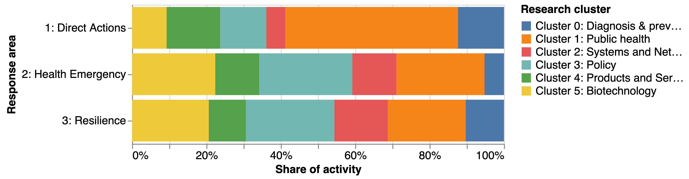{#fig:covid_levels}

### National participation and representation in the Covid-19 response

Having classified Covid-response projects in different research clusters, we move to analyse the levels of national participation in the EU Covid-19 research response. 

[@fig:country_spec] presents, for the top 15 countries by level of project coordination activity, their 'relative specialisation' in each Covid-19 research cluster (in the horizontal axis) and their overall volume of activity (size of the points).^[We measure specialisation using a Relative Comparative Advantage (RCA) index that normalises the share of activity in a cluster in each country by the overall share of activity accounted for by that country, also including non-Covid 19 related research and restricting our analysis after 2019, comprising most of the Covid-19 activity [@balassa1965trade]. RCA scores above one represent relative positive specialisation in a topic, an scores below one represent relative underspecialisation.] We sort the countries by their mean specialisation over all Covid-19 research clusters so that countries at the top of the chart tend to be overrepresented in the coordination of the Covid-19 research response while countries towards the bottom are underrepresented.

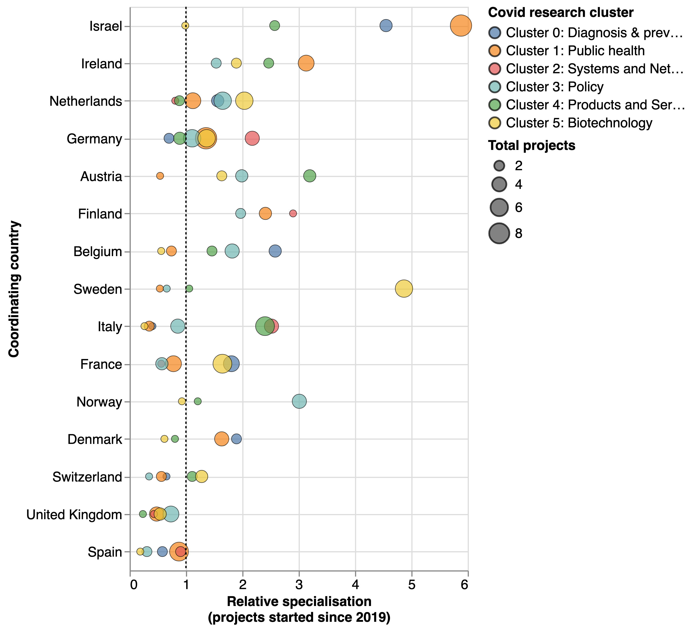{#fig:country_spec}

This analysis shows that Israel, Ireland, the Netherlands and Germany are overrepresented in the Covid-19 research response while Spain, the United Kingdom and Switzerland are underrepresented. We also find that some countries are overrepresented in some Covid-19 research areas and underrepresented in others. For instance, Sweden has a high degree of activity in the Covid-19 biotechnology research cluster (six times higher than we might have expected given its overall levels of coordination of H2020 projects after 2019). Italy is overrrepresented in Products and Services and Systems and Networks and generally underrepresented in other areas.

There are many possible explanations for these international differences including different degreses of agility in national R&I systems, variation in the availability of alternative funding sources (e.g. national or philanthropic) for Covid-19 reponse projects across countries, or presence of established capabilities and networks enabling countries to rapidly coordinate Covid-19 projects in particular areas. We will explore the last mechanism in further detail below.

## Measuring semantic relatedness to Covid-19 projects in the CORDIS corpus

We use the Specter language model to create vector representations of H2020 projects that were not included in our Covid-19 labelled dataset. This allows us to identify projects that are semantically similar (close in vector space) to Covid-19 research. We use the resulting information in two ways:

1. To measure levels of EC investment in projects related to societal / economic / health emergency preparedness _before and during_ the pandemic.
2. Measure established research capabilities in research areas related to the pandemic in different countries _before it happened_ which might explain subsequent differences in the levels of national coordination of Covid-19 projects.

We create a semantic signature / "centroid" for each Covid-19 research cluster - the median of the vector representations for all projects classified in a research cluster - and measure the distance of all non-Covid-19 related projects to that semantic signature using the cityblock (Manhattan or L1) distance metric [melter1987some]. 

[@fig:dist_distr] presents the distributions of distances to those clusters signatures from projects inside each Covid-research cluster (in orange) and outside (in blue), 

{#fig:dist_distr}

The figure shows, unsurprisingly, that projects that are part of a Covid-19 cluster tend to be closer to its centroid than those outside. 

We also see notable differences between Covid-19 research clusters. In the case of cluster 0 (Diagnosis and Prevention) and cluster 5 (Biotechnology) there is a strong degree of separation between Covid-19 and non-Covid-19 projects while cluster 1, 3 and 4 (public health, policy and products and services) present a strong overlap suggesting fuzzier semantic boundaries between both categories and the risk of false positives if we do not adjust the threshold to define relatedness to a Covid-19 research cluster carefully. In order to do this, we draw on a measure of dispersion in the distribution of distances to each of the Covid-19 clusters: any non-Covid project that is two standard deviations closer to the centroid of a Covid-19 research cluster than the mean is defined as "semantically similar" to that cluster. As the green vertical lines in {#fig:dist_distr} show, this thresold is more demanding for fuzzier Covid-19 research clusters.

In total, we identify 6,244 projects related or 'close' to various Covid-19 research clusters. We present some (randomly drawn) examples in table [@#tbl:prox_ex]. It shows that projects related to health and biomedical Covid-19 research clusters are highly related or adjacent to pandemic use cases (e.g. use of AI methods to analyse CT scans, development of testing devices, RNA analysis in plant infections) while the relevance of policy, networking and product and services projects is somewhat looser (tackling energy poverty in urban settings, development of lightweight materials).  

\small
| Cluster                           |    n | Examples                                                                                                                                                      |
|:----------------------------------:|-----:|:--------------------------------------------------------------------------------------------------------------------------------------------------------------|
| Cluster 0: Diagnosis & prevention |  467 | AI-based Chest CT Analysis Enabling Rapid Covid Diagnosis And Prognosis, (2020)                                                                               |
|                                   |      |  A Simple Blood Test To Monitor Disease Progression In Patients Undergoing Cancer Therapy, (2015)                                                             |
|                                   |      |  Ser-col; From Finger To Laboratory; Personalized And Automated Serum Collection For Laboratory Diagnostics, (2019)                                           |
| Cluster 1: Public health          |  680 | Pulsehale - A Breakthrough Treatment  For COPD, (2021)                                                                                                      |
|                                   |      |  The Clinical Flexible Analyzer- A New Generation Ivd Testing Device Aimed To Increase The Competitiveness Of Local Healthcare Vs. Large Laboratories, (2018) |
|                                   |      |  Lipiddrive - Lipidomics Cloud Computing Platform And App, (2017)                                                                                             |
| Cluster 2: Systems and Networks   |  980 | Scientific Large-scale Infrastructure For Computing/communication Experimental Studies Starting Community, (2021)                                           |
|                                   |      |  Enhancing Innovation And Key Account Management By Sme2eu, (2019)                                                                                            |
|                                   |      |  Bringing Firmware To The Next Step, (2016)                                                                                                                     |
| Cluster 3: Policy                 | 1671 | Law As Vehicle For Social Change: Mainstreaming Non-extractive Economic Practices, (2020)                                                                     |
|                                   |      |  Improving Health, Wellbeing And Equality By Evidenced-based Urban Policies For Tackling Energy Poverty, (2021)                                               |
|                                   |      |  Urban Terrorism In Europe (2004-2019): Remembering, Imagining, And Anticipating Violence, (2019)                                                             |
| Cluster 4: Products and Services  |  874 | Open Access Single Entry Point For Scale-up Of Innovative Smart Lightweight Composite Materials And Components, (2019)                                        |
|                                   |      |  Smart And Interoperable Thermal Network System Development, (2015)                                                                                           |
|                                   |      |  Development Of A New Gearbox Without Lubricants For Low OM Costs, Higher Efficiency, And Oiless Applications, (2016)                                         |
| Cluster 5: Biotechnology          | 1572 | Genome-wide Analysis Of RNA And Protein Interacting Profiles During A Plant Virus Infection, (2015)                                                           |
|                                   |      |  Control Of Leishmaniasis, From Bench To Bedside And Community, (2015)                                                                                        |
|                                   |      |  Personalised Pancreatic Cancer Vaccination Therapy Derived From Autologous Tumor Cells And Neoantigens, (2018)                                               |
: Examples of research projects that are semantically related to Covid-19 research clusters {#tbl:prox_ex}

\normalsize

[@fig:related_trend] presents the evolution of activity in Covid-19 related projects (excluding projects in the initial labelled set). It shows relative stability in the number of projects in Covid-19 / societal emergency areas over time, although we note some spikes of activity that might be related to specific funding calls in 2019 and 2021 which could be an focus of interest for future research.

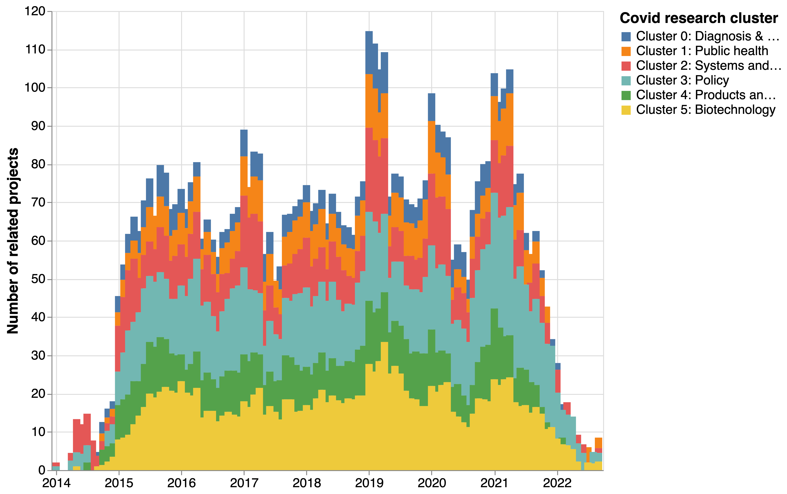{#fig:related_trend}

### Measuring national capabilities in Covid-19 related areas before the pandemic.

We use the measures of relatedness to identify corpora of projects related to various Covid-19 research clusters _before the pandemic_. We then calculate relative specialisation of countries in each of those research clusters based on the number of projects that they coordinated within them, which we consider to be a proxy for the presence of established capabilities and networks in those research areas. Are countries with such capabilities more active when the pandemic arrives?

One issue here is that our measures of specialisation might be contingent on the Covid-19 relatedness thresholds that we select. We assess their robustness by estimating the levels of national specialisation in a Covid research cluster under different thresholds (between 1.5 and 2.5 standard deviations closer to the centroid of the covid cluster than the mean for non-Covid projects) and present the results in [#fig:sim_interv]. 

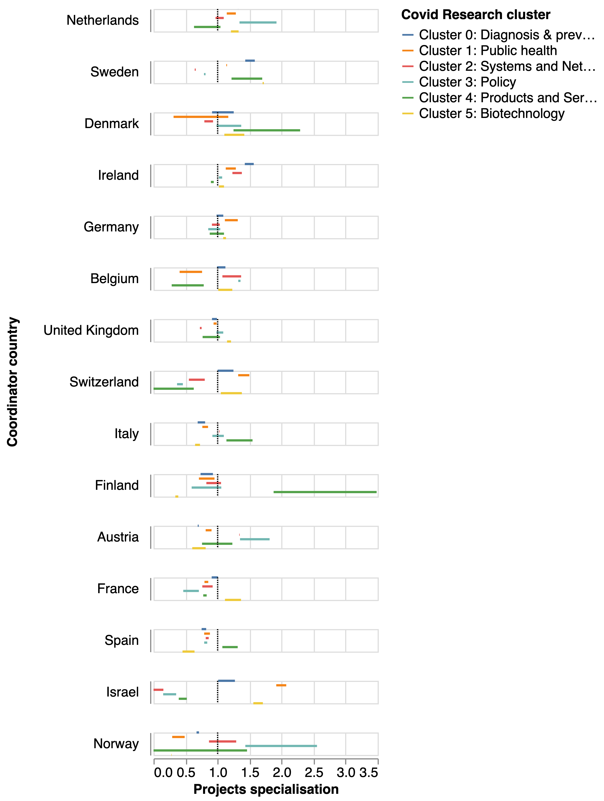{#fig:sim_interv}

The chart suggests that the measures of specialisation in Covid research clusters such as Products and Services and Policy - where as we noted below there is a higher degree of semantic overlap between Covid and non-Covid projects - are particularly volatile. In contrast, estimates of specialisation in biomedical research clusters such as Diagnosis and Prevention and Biotechnology seem to be more robust.

In [@fig:prep_plot] we compare specialisation in Covid-19 related topics before (horizontal axis) and after the pandemic for the top 15 countries by level of project coordination, with Covid research clusters sorted by the strength of the rank-correlation between specialisation before the pandemic and specialisation afterwards.

{#fig:prep_plot}

The chart shows a strong correlation between pre and post coordination specialisation in some research areas such as Biotechnology, Policy and Public Health while the correlation is negative in the Products and Services research cluster (where, as we just pointed out, our measures of specialisation pre-pandemic are noisier). Understanding what drives the differences between research areas and what explains whether countries are able to exploit - or not - their research strenghts in Covid-19 related areas with the arrival of the pandemic are important questions for future research.

### Organisational proximity and participation in Covid-19 related research

The semantic approach we described can also be used to measure organisational relatedness to Covid-19 research. In order to do this, we calculate the mean of the vector representations of all projects involving each organisation in the Cordis database before the pandemic, and measure its (cityblock) distance to the centroids of all our Covid-19 research clusters. Our prior, based on the Principle of Relatedness studied in economic geography and economic complexity, is that countries 'closer' to those clusters are more likely to participate in Covid-19 related research when the pandemic arrives because they have the right capabilities to do so [@hidalgo2018principle].

We present the results by Covid-19 research cluster and country in [@fig:org_dist]. The points represent the share of organisations in a country and rank of proximity to the centre of the Covid-19 cluster that did in fact participate (in any role) in Covid-19 projects. One way to think about this is as a proxy for the 'utilisation' of related organisational capabilities in the Covid-19 research respose. 

{#fig:org_dist}

Points towards the right represent organisations that were semantically closer to Covid-19 research clusters - we see that, almost without exception, this group of organisations were more likely to participate in Covid-19 projects, in line with what we would expect. Having said this, the chart also shows important differences between countries and research clusters, suggesting variation in Covid-19 deployment capabilities and perhaps an underutilisation of knowledge that might have been relevant in the fight against the pandemic. For example, when we look at the "Biotechnology" research cluster we find that almost 25%% of the Dutch organisations in the top decile of semantic proximity to that research cluster participated in Covid-19 projects, while less than 10% of Spanish organisations did. 

### Topical composition of the Covid-19 research response.

Having segmented EC-funded research activities to tackle the Covid-19 pandemic into broad research segments, we move to a more finely grained analysis using a hierarchical topic model that uses Bayesian methods to infer the distribution of words over topics (capturing clusters of frequently co-occurring words potentially reflecting a 'theme' or subject) and the distribution of topics over documents (capturing these documents' thematic focus) [@gerlach2018network]. Our goal is to compare the topical composition of Covid-19 oriented EC-funded projects with the broader CORDIS corpus in order to understand what topics are overrepresented and what topics are underrepresented in the EC R&I response captured in the CORDIS dataset.

We train the topic model on a corpus of H2020 projects started since 2019, resulting in the extraction of 289 topics from the data. In order to simplify the presentation of results, we cluster those topics into a smaller set of 17 subjects using a network-based approach.^[This entails creating a topic co-occurrence network connecting those topics that tend to appear in the same documents, and decomposing them through a community detection approach along the lines of what we described earlier. We name the resulting categories after a visual inspection of their constituent topics.] We then regress (using ordinary least squares) each topic's distribution over projects on an indicator variable capturing whether a project was part of the EC Covid-19 research response, and whether it was in one of the Covid-19 research categories we have used in previous subsections. Figures [@fig:covid_topics] and [@fig:cluster_topics] respectively present the estimated regression coefficients and confidence intervals for each topic according to these models.

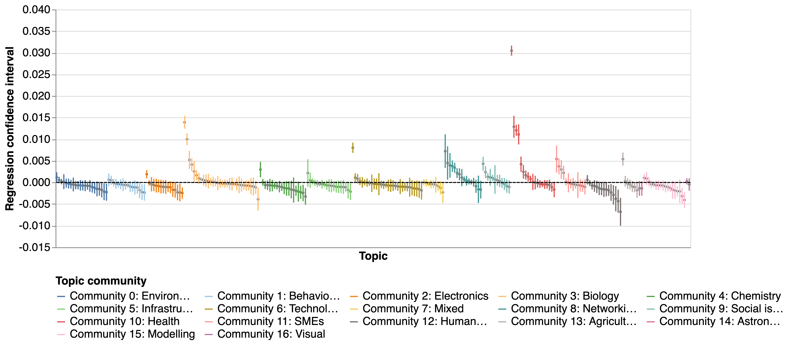{#fig:covid_topics}

{#fig:cluster_topics}

[@fig:covid_topics] shows that, perhaps unsurprisignly, topics related to biology (topic community 4) and health (topic community 10) are overrepresented in the Covid-19 response compared to the broader corpus. We also find an overrepresentation of topics about networking and SMEs (topic communities 8 and 11), reflecting the Commission support for innovative ventures and research and business collaboration networks during the pandemic. Topics related to the Environment (topic community 0), Humanities (topic community 12) and - perhaps more surprisingly - modelling (topic community 16) appear relatively underrepresented compared to the broader H2020 portfolio. Having said this, the more granular perspective offered by [@fig:cluster_topics] suggests that some of these topics have a presence in particular segments of the Covid-19 research response, as is the case with Humanities topics in the policy research cluster, and Modelling in the systems and networks cluster.

## Research publications {#sec:paper}

Having analysed the R&I funding activities in response to the pandemic by a key stakeholder for the EURITO project - the European Commission - we turn to an analysis of research publications with a particular focus on preprints, an method for research dissemination that might offer us a particularly timely perspective on the evolution and geography of the response to the pandemic [@fraser2020preprinting, @majumder2020early]. 

Several studies of the role of preprints in the Covid-19 pandemic have recognised their value as an important channel for rapid scientific communication during the crisis [@fraser2021evolving] while highlighting some of their risks, in particular the dissemination of scientific returns that have not been subject to peer-review [@besanccon2020open]. In general, research published via pre-prints is found to achieve wider dissemination and visibility in news and social media [@fraser2021evolving] while it suffers in some cases from low levels of reproducibility and transparency [@besanccon2020open]. 

We are also interested in what these data can tell us about the dynamics of the research response to the pandemic. For example, some studies suggest lower levels of collaboration brought about by the need to "work fast" and locally [@fry2020consolidation], and have also raised concerns about "research races" whcih attract new entrants focused on topics with short-term benefits at the expense of more patient and interdisciplinary research [@bryan2020innovation]. 

### Data sources

We start with a dataset with 2.5 million documents including preprints from arXiv (focusing on Physics, Mathematics and Computer Science), biorXiv (focusing on Biology) and medrXiv (focused on Medical Sciences) and the CORD19 database of Covid-19 related publications compiled by a consortium of research funders and technology companies led by the Allen Institute for AI [@wang2020cord]. We filter this data so that it only includes articles with titles and abstract that mention Covid-19 related terms and finish with a dataset of around 250,000 documents, including 230,000 from CORD-19 (mostly comprising peer-reviewed publications), almost 14,000 preprints from medrXiv, 4,500 from arXiv and 4,300 from biorXiv.^[We exclude from the CORD-19 corpus articles about virus research in general [@colavizza2021scientometric].]. 

### Temporal and thematic differences between preprints and peer-reviewed publications

In [@fig:article_trends] we compare the temporal distribution of activity in our data by article source (type) focusing on the year 2020.^[A large number of CORD-19 articles for 2021 only contain their year of publication so it was not possible to extend the analysis further]. It shows that preprint activity responded faster to the onset of the pandemic that peer-reviewed publications in CORD-19, with arXiv reaching an initial peak followed by medrXiv and biorXiv. This finding is consistent with the idea that preprints played a role in the rapid dissemination of research findings earlier in the pandemic.

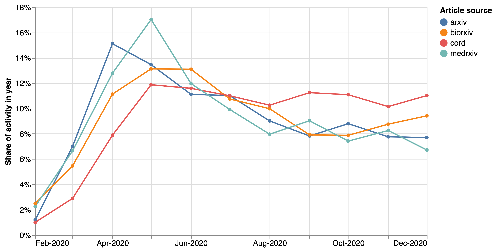{#fig:article_trends}

In order to compare the thematic composition of preprints and peer-reviewed publications, we fit a Latent Dirichlet Allocation topic model on our whole corpus and, like we did before, regress the resulting topic distributions on an indicator variable for whether a document is a preprint or a peer-reviewed publication from CORD-19 [@blei2003latent].^[We classify topics into disciplines using the fields of study assigned to papers by Microsoft Academic Graph [@wang2020microsoft].] The results, which we present in [@fig:article_topical] show that several biological topics related to genetic analysis of Covid-19 and vaccines, as well as computer vision analysis of medical scans and predictive analyses of the evolution of the pandemic are overrepresented in the preprint corpus, while topics related to policy / Political Science, Economics, Psychology, Sociology and the Humanities tend to be underrepresented.^[We also note that some topics seem to have captured clusters of words in articles that were not written in English in the CORD data.].

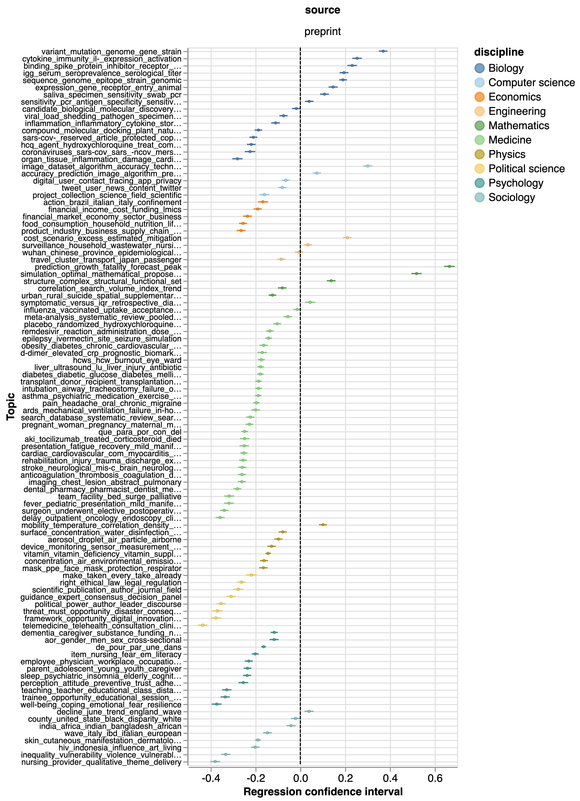{#fig:article_topical}

These thematic differences between preprints and peer-reviewed publications could be explained by differences in the communities that target different dissemination venues, or by differences in the velocity with which different fields responded to the pandemic, either because their contributions were perceived to be particularly urgent or because they had capabilities to create research and knowledge rapidly in response to the pandemic. We probe this idea further by comparing the publication sequence of papers in topics that were dominant in preprints and papers in topics that were dominant in peer-reviewed publications only focusing on peer reviewed publications in 2021. 

We present the results in {#fig:pub_trends} where we see that papers involving topics overrepresented in preprints also tended to be published earlier in peer-reviewed publications, suggesting that there are topic-specific drivers of publication velocity independent from the venue where a paper is published.

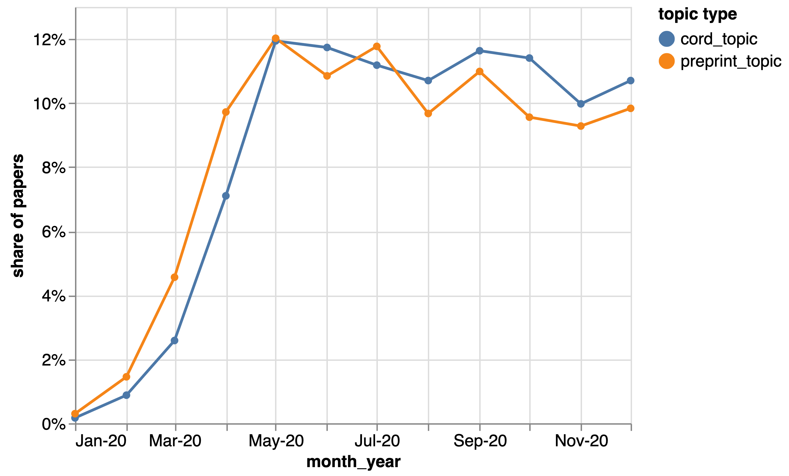{#fig:pub_trends}

We have decided to focus the rest of our analysis on the preprints corpus. The reason for this is that the data are more timely (exact publication dates are available for all articles adn not a subset, as is the case with CORD-19) and, as we just showed, the focus of the articles is on topics that are disseminated more rapidly and where access to timely indicators might be more useful. This also allow us to implement more robust (although less scalable) topic modelling algorithms [@gerlach2018network]. Before doing this, we compare the international distribution of publications in order to assess if this brings coverage biases into our analysis.

[@fig:pub_corr] shows the rank correlation between national shares of activity in different publication venues. It shows a strong degree of correlation between national shares of activity, particularly in the case of medrXiv and CORD, suggesting that medical research communities are similarly present in both sources. The rank correlation between national shares of activity is weakest between arXiv and CORD, potentially reflecting differences in national research focus and publication strategies.

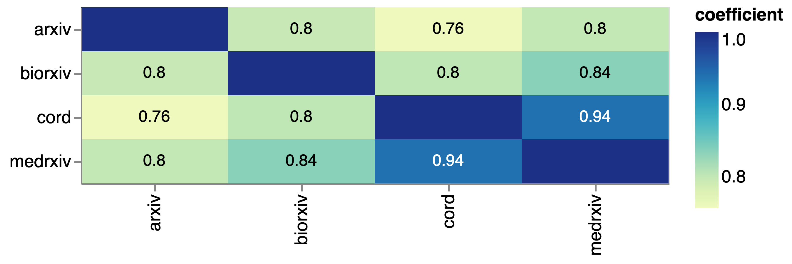{#fig:pub_corr}

In [@fig:country_shares] we present the shares of publication activity accounted by different countries in the top 25 by activity. We use a logarithmic scale in the x-axis to increase the visibility of the differences between venue focus in countries that are not on the top 3 (USA, United Kingdom and China). In general, the chart suggests that the use of preprints as a proxy for research activity would not lead to a massive under-representation of specific countries perhaps with the exception of Iran, where the share of Cord19 publications is substantially higher than the share of preprints.

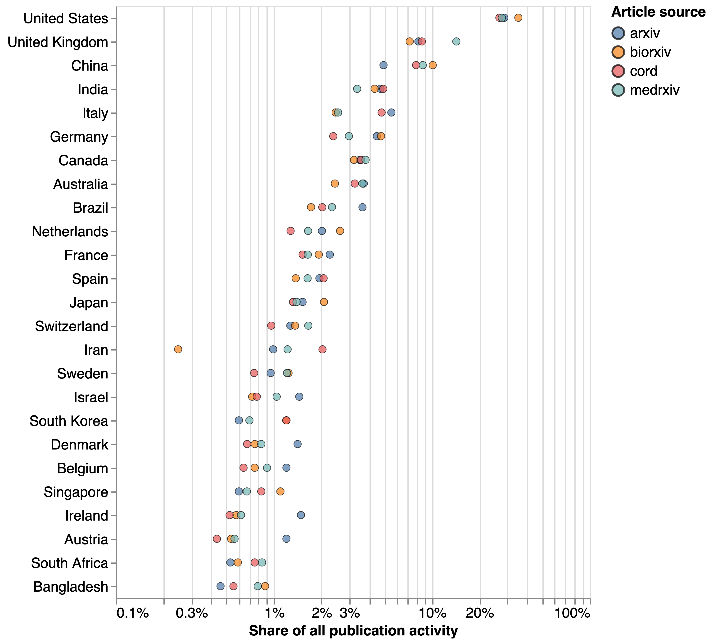{#fig:country_shares}

### Preprint research themes

We have clustered Covid-19 related articles based on their topical compositions using the SBM topic model [@gerlach2018network] and named each cluster after a visual inspection of its contents and an analysis of its most salient terms compared to the corpus overall. 

[@fig:cluster_sources] presents the number of papers in each cluster and their preprint sources, and [@tbl:cluster_examples] provides some randomly drawn examples of papers in each category. 

We note the sorting of research topics into publication venues: articles related to biological disciplines such as genetic analysis or antiviral drugs were published in arXiv, papers about Covid-19 population and patient impacts and Hospitalisation primarily go into medrXiv and papers that analyse social media data and medical scans using machine learning methods are disseminated via arXiv.

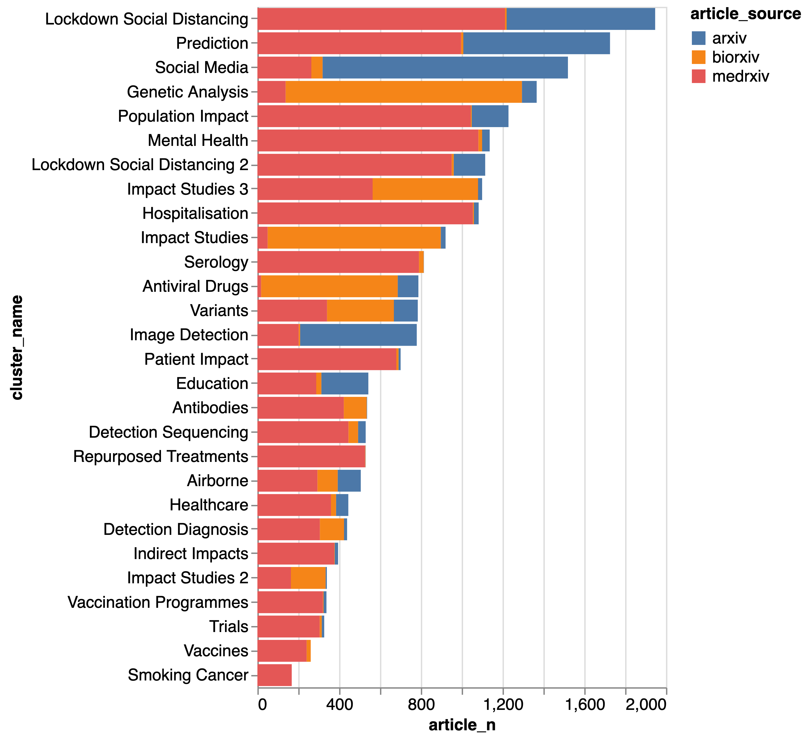{#fig:cluster_sources}

\small
| Cluster                      |    n | Examples                                                                                                                                                                                                                |
|:-----------------------------:|:-------------:|:--------------------------------------------------------------------------------------------------------------------------------------------------------------------------------------------------|
| Lockdown Social Distancing   | 1947 | Do e-scooters fill mobility gaps and promote equity before and during                                                                                                                                                   |
|                              |      |   COVID-19? A spatiotemporal analysis using open big data                                                                                                                                                               |
|                              |      |  Spatially refined time-varying reproduction numbers of SARS-CoV-2 in Arkansas and Kentucky and their relationship to population size and public health policy, March November, 2020                                  |
|                              |      |  COVID-19 pandemic-related lockdown: response time is more important than its strictness                                                                                                                                |
| Prediction                   | 1726 | Sub-epidemic model forecasts for COVID-19 pandemic spread in the USA and European hotspots, February-May 2020                                                                                                           |
|                              |      |  Epilocal: a real-time tool for local epidemic monitoring                                                                                                                                                               |
|                              |      |  Analyzing COVID-19 pandemic with a new growth model for population                                                                                                                                                     |
|                              |      |   ecology                                                                                                                                                                                                               |
| Social Media                 | 1520 | Artificial Intelligence-based Clinical Decision Support for COVID-19 --                                                                                                                                                 |
|                              |      |   Where Art Thou?                                                                                                                                                                                                       |
|                              |      |  Accelerating COVID-19 research with graph mining and transformer-based                                                                                                                                                 |
|                              |      |   learning                                                                                                                                                                                                              |
|                              |      |  Challenges of Equitable Vaccine Distribution in the COVID-19 Pandemic                                                                                                                                                  |
| Genetic Analysis             | 1367 | COVID-19 dominant D614G mutation in the SARS-CoV-2 spike protein desensitizes its temperature-dependent denaturation                                                                                                    |
|                              |      |  The ongoing evolution of variants of concern and interest of SARS-CoV-2 in Brazil revealed by convergent indels in the amino (N)-terminal domain of the Spike protein                                                  |
|                              |      |  Serum Neutralizing Activity of mRNA-1273 against SARS-CoV-2 Variants                                                                                                                                                   |
| Population Impact            | 1229 | Unraveling the Dynamic Importance of County-level Features in Trajectory                                                                                                                                                |
|                              |      |   of COVID-19                                                                                                                                                                                                           |
|                              |      |  Multiple drivers of the COVID-19 spread: role of climate, international mobility, and region-specific conditions                                                                                                       |
|                              |      |  Hospital preparedness in epidemics by using simulation. The case of COVID-19                                                                                                                                           |
| Mental Health                | 1137 | COVID-19 preventive behaviors among people with anxiety and depression: Findings from Japan                                                                                                                             |
|                              |      |  Worsening of pre-existing psychiatric conditions during the COVID-19 pandemic                                                                                                                                          |
|                              |      |  Adenovirus and RNA-based COVID-19 vaccines: perceptions and acceptance among healthcare workers                                                                                                                        |
| Lockdown Social Distancing 2 | 1115 | Successful contact tracing systems for COVID-19 rely on effective quarantine and isolation                                                                                                                              |
|                              |      |  Dark matter, second waves and epidemiological modelling                                                                                                                                                                |
|                              |      |  SYSTEMATIC OBSERVATION OF COVID-19 MITIGATION (SOCOM): ASSESSING FACE COVERING AND DISTANCING IN SCHOOLS                                                                                                               |
| Impact Studies 3             | 1100 | SARS-CoV-2 infection in the Syrian hamster model causes inflammation as well as type I interferon dysregulation in both respiratory and non-respiratory tissues including the heart and kidney                          |
|                              |      |  Increased Expression of Chondroitin Sulfotransferases following AngII may Contribute to Pathophysiology Underlying Covid-19 Respiratory Failure: Impact may be Exacerbated by Decline in Arylsulfatase B Activity      |
|                              |      |  Identification of potential key genes for SARS-CoV-2 infected human bronchial organoids based on bioinformatics analysis                                                                                               |
| Hospitalisation              | 1083 | Is the psychological well-being of a population associated with COVID-19 related survival?                                                                                                                              |
|                              |      |  COVID-19 TARRACO Cohort Study: Development of a predictive prognostic rule for early assessment of COVID-19 patients in primary care settings                                                                          |
|                              |      |  Heterogeneity in COVID-19 severity patterns among age-gender groups: an analysis of 778 692 Mexican patients through a meta-clustering technique                                                                       |
| Impact Studies               |  921 | Differential roles of RIG-I-like receptors in SARS-CoV-2 infection                                                                                                                                                      |
|                              |      |  Recombinant SARS-CoV-2 RBD molecule with a T helper epitope as a built in adjuvant induces strong neutralization antibody response                                                                                     |
|                              |      |  The 2019 coronavirus (SARS-CoV-2) surface protein (Spike) S1 Receptor Binding Domain undergoes conformational change upon heparin binding.                                                                             |
| Serology                     |  815 | Evaluation of Serological SARS-CoV-2 Lateral Flow Assays for Rapid Point of Care Testing                                                                                                                                |
|                              |      |  Evaluation of saliva sampling procedures for SARS-CoV-2 diagnostics reveals differential sensitivity and association with viral load                                                                                   |
|                              |      |  Prevalence of SARS-CoV-2 among high-risk populations in Lom&eacute (Togo) in 2020                                                                                                                                      |
| Antiviral Drugs              |  788 | Structural basis for repurpose and design of nucleoside drugs for treating COVID-19                                                                                                                                     |
|                              |      |  Nonstructural protein 1 of SARS-CoV-2 is a potent pathogenicity factor redirecting host protein synthesis machinery toward viral RNA.                                                                                  |
|                              |      |  Automatic design of novel potential 3CL$^{\text{pro}}$ and                                                                                                                                                             |
|                              |      |   PL$^{\text{pro}}$ inhibitors                                                                                                                                                                                          |
| Variants                     |  785 | An effective COVID-19 response in South America: the Uruguayan Conundrum                                                                                                                                                |
|                              |      |  in-silica Analysis of SARS-CoV-2 viral strain using Reverse Vaccinology Approach: A Case Study for USA                                                                                                                 |
|                              |      |  Nosocomial outbreak of SARS-CoV-2 in a 'non-COVID-19' hospital ward: virus genome sequencing as a key tool to understand cryptic transmission                                                                          |
| Image Detection              |  780 | COVID-19 Infection Localization and Severity Grading from Chest X-ray                                                                                                                                                   |
|                              |      |   Images                                                                                                                                                                                                                |
|                              |      |  COVID-Net S: Towards computer-aided severity assessment via training and                                                                                                                                               |
|                              |      |   validation of deep neural networks for geographic extent and opacity extent                                                                                                                                           |
|                              |      |   scoring of chest X-rays for SARS-CoV-2 lung disease severity                                                                                                                                                          |
|                              |      |  End-to-End AI-Based Point-of-Care Diagnosis System for Classifying                                                                                                                                                     |
|                              |      |   Respiratory Illnesses and Early Detection of COVID-19                                                                                                                                                                 |
| Patient Impact               |  701 | Changes in RT-PCR-positive SARS-CoV-2 rates in adults and children according to the epidemic stages                                                                                                                     |
|                              |      |  COVID-19 infection and subsequent thromboembolism: A self-controlled case series analysis of a population cohort                                                                                                       |
|                              |      |  A New Hematological Prognostic Index For Covid-19 Severity                                                                                                                                                             |
| Education                    |  543 | Years of life lost due to the psychosocial consequences of COVID19 mitigation strategies based on Swiss data                                                                                                            |
|                              |      |  Assessing knowledge, concerns, and risk perceptions among Italian medical students during the SARS-CoV-2 pandemic.                                                                                                     |
|                              |      |  Supply and demand shocks in the COVID-19 pandemic: An industry and                                                                                                                                                     |
|                              |      |   occupation perspective                                                                                                                                                                                                |
| Antibodies                   |  537 | SARS-CoV-2 seroassay optimization and performance in a population with high background reactivity in Mali                                                                                                               |
|                              |      |  Original antigenic sin responses to heterologous Betacoronavirus spike proteins are observed in mice following intramuscular administration, but are not apparent in children following SARS-CoV-2 infection           |
|                              |      |  SARS-CoV-2 antigens expressed in plants detect antibody responses in COVID-19 patients                                                                                                                                 |
| Repurposed Treatments        |  530 | HYDROXICLOROQUINE FOR PRE-EXPOSURE PROPHYLAXIS FOR SARS-CoV-2                                                                                                                                                           |
|                              |      |  Tocilizumab Effect in COVID-19 Hospitalized Patients: A Systematic Review and Meta-Analysis of Randomized Control Trials                                                                                               |
|                              |      |  Beneficial and Harmful Outcomes of Tocilizumab in Severe COVID-19: A Systematic Review and Meta-Analysis                                                                                                               |
| Detection Sequencing         |  530 | High-frequency screening combined with diagnostic testing for control of SARS-CoV-2 in high-density settings: an economic evaluation of resources allocation for public health benefit                                  |
|                              |      |  High sensitivity detection of coronavirus SARS-CoV-2 using multiplex PCR and a multiplex-PCR-based metagenomic method                                                                                                  |
|                              |      |  SARS-COV-2 VIRUS INFECTED PATIENT IDENTIFICATION THROUGH CANINE OLFACTIVE DETECTION ON AXILLARY SWEAT SAMPLES                                                                                                          |
| Airborne                     |  506 | Luminore CopperTouche surface coating effectively inactivates SARS-CoV-2, Ebola and Marburg viruses in vitro                                                                                                            |
|                              |      |  N95 Mask Decontamination using Standard Hospital Sterilization Technologies                                                                                                                                            |
|                              |      |  Seasonal stability of SARS-CoV-2 in biological fluids                                                                                                                                                                  |
| Healthcare                   |  445 | The prevention of nosocomial SARS-CoV2 transmission in endoscopy: a systematic review of recommendations within gastroenterology to identify best practice.                                                             |
|                              |      |  Effects of the COVID-19 pandemic on publication landscape in chimeric antigen receptor-modified immune cell research                                                                                                   |
|                              |      |  Meta-Research: Citation needed? Wikipedia and the COVID-19 pandemic                                                                                                                                                    |
| Detection Diagnosis          |  439 | A Public Website for the Automated Assessment and Validation of                                                                                                                                                         |
|                              |      |   SARS-CoV-2 Diagnostic PCR Assays                                                                                                                                                                                      |
|                              |      |  Comparison of Commercially Available and Laboratory Developed Assays for in vitro Detection of SARS-CoV-2 in Clinical Laboratories                                                                                     |
|                              |      |  Graphene-based optical sensors for the pre-vention of SARS-CoV-2 viral                                                                                                                                                 |
|                              |      |   dissemination                                                                                                                                                                                                         |
| Indirect Impacts             |  395 | The association between lockdown due to COVID-19 epidemic and searches for toothache using Google Trends in Iran                                                                                                        |
|                              |      |  The effect of BMI and physical activity levels on the duration of symptomatic days with Covid-19 infection                                                                                                             |
|                              |      |  Age, gender and COVID-19 infections                                                                                                                                                                                    |
| Impact Studies 2             |  340 | A household case evidences shorter shedding of SARS-CoV-2 in naturally infected cats compared to their human owners.                                                                                                    |
|                              |      |  Defining the Syrian hamster as a highly susceptible preclinical model for SARS-CoV-2 infection                                                                                                                         |
|                              |      |  Susceptibility of tree shrew to SARS-CoV-2 infection                                                                                                                                                                   |
| Vaccination Programmes       |  338 | Impact of vaccination in reducing Hospital expenses, Mortality and Average length of stay among COVID-19 patients: a retrospective cohort study from India                                                             |
|                              |      |  Real-time assessment of COVID-19 impact on global surgical case volumes                                                                                                                                                |
|                              |      |  Fevers Are Rarest in the Morning: Could We Be Missing Infectious Disease Cases by Screening for Fever Then?                                                                                                            |
| Trials                       |  327 | COVID-19 Mortality Following Mass Gatherings                                                                                                                                                                            |
|                              |      |  Outcomes of COVID-19 infection in patients treated with Clozapine                                                                                                                                                      |
|                              |      |  Antibacterial consumption in the context of COVID-19 in Pakistan: an analysis of national pharmaceutical sales data for 2019-20                                                                                        |
| Vaccines                     |  261 | Older age is associated with sustained detection of SARS-CoV-2 in nasopharyngeal swab samples                                                                                                                           |
|                              |      |  Neutralization of Delta variant with sera of Covishield vaccinees and COVID-19 recovered vaccinated individuals                                                                                                        |
|                              |      |  Immunogenicity of COVID-19 Vaccination in Immunocompromised Patients: An Observational, Prospective Cohort Study Interim Analysis                                                                                      |
| Smoking Cancer               |  168 | Association of the Covid-19 lockdown with smoking, drinking, and attempts to quit in England: an analysis of 2019-2020 data.                                                                                            |
|                              |      |  Clinical Characteristics and Severity of COVID-19 Disease in Patients from Boston Area Hospitals                                                                                                                       |
|                              |      |  Association between angiotensin-converting enzyme inhibitors and angiotensin II receptor blockers use and the risk of infection and clinical outcome of COVID-19: a comprehensive systematic review and meta-analysis. |
: Examples of articles in Covid-19 research clusters {#tbl:cluster_examples}

\normalsize
In order to evaluate the robustness of our clustering results, we have compared them with the outputs of an ensemble of K-Means clustering algorithms using different cluster sizes and random initialisations.^[The K-Means algorithm looks for ways to partition the data in K groups in a way that maximises similarities inside groups and differences between groups [@macqueen1967some].] [@fig:cluster_co_occs] displays the number of co-occurrences that had initially been placed in our canonical clusters. We see that each of the cluster has the largest number of co-occurrences in the diagonal (i.e. our test algorithms tend to place together observations that were already together in the original clustering). In those cases where we observe strong overlap between clusters this appears to be driven by semantic and application similarities between clusters, as is the case with "Variants" and "Genetic analysis", between "Prediction" and "Social distancing" or between "Repurposed treatments" and "Hospitalisation". 

This suggests that our clustering results are robust and that overlaps between clusters are explainable.

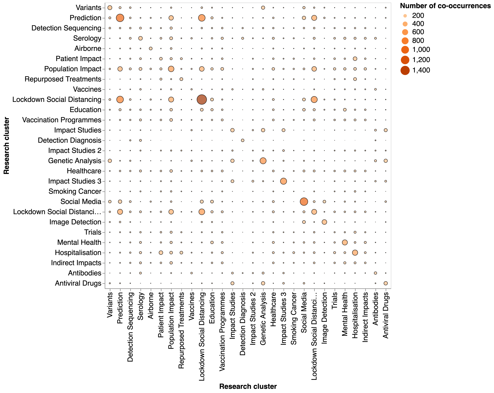{#fig:cluster_co_occs}

### Thematic evolution of activity

We continue by analysing temporal patterns of activity in different Covid-19 research clusters. [@fig:topic_evol] presents the results, which we sort based on the share of overall activity by June 2021 - in other words, by the extent to which research activity in a theme took place earlier in the pandemic.

The chart shows a striking sorting of research efforts that seems to mirror various phases in the evolution of the pandemic and the policy, medical and scientific response to it: earlier on we see the bulk of activity in research topics related to the prediction of the evolution of the pandemic ands its impact, diagnosis of the Covid-19, social distancing policies and mitigation of its impact on the heathcare system. Later on, topics related to longer term and indirect impacts of the pandemic, and on vaccines and the vaccination programmes started in 2021 become more prominent. We note with interest spikes of activity in the Trials research cluster in July - this month saw intense trial activity around the Pzifer/BioNtech, Moderna and AstroZeneca/Oxford vaccines. All these results suggest that our dataset of research preprints offers a timely window into the evolution of key activities in the global R&D response to the pandemic.

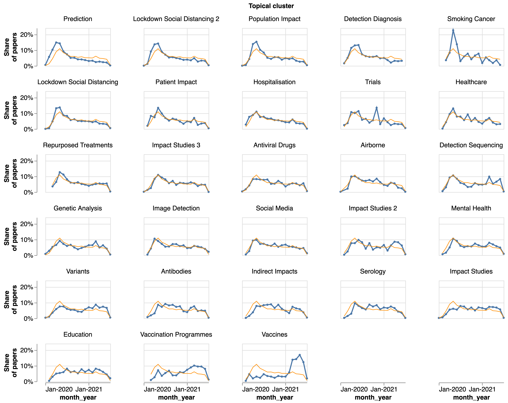{#fig:topic_evol}

### Geography of Covid-19 research and specialisation

We have enriched our publication data with information about the institutional affiliation of researchers involved in Covid-19 publications and their geography. This yields a total of 134 countries and 1,638 cities with some research activity in response to the pandemic. We visualise the results in [@fig:combi_geo]. The chart shows a strong concentration of activity in a small number of (mostly developed) countries and cities.

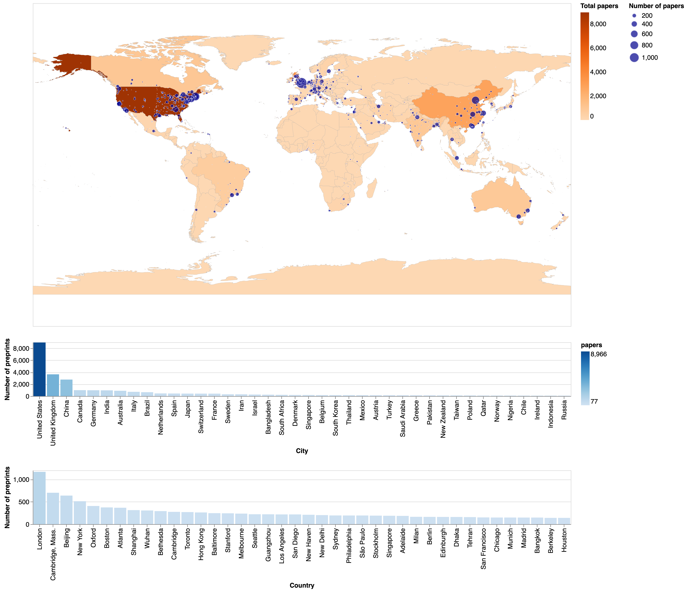{#fig:combi_geo}

Aggregate maps of preprint activity related to Covid-19 mask important differences in the geography of the Covid-19 response across research clusters. In [@fig:prep_country_spec] we show the levels of activity and relative specialisation (based on a relative comparative advantage index) by country and Covid-19 research cluster. We have arranged the axes based on the similarity between country / research clusters specialisation profiles.  

The heatmap shows some interesting differences between countries - for example, the UK seems to be relatively specialised in topics related to the impact of the pandemic and the public health response while Israel specialises in detection and diagnosis, vaccination programmes and trials. Combined with other data, these indicators could help understand the composition of different country's Covid-19 response.

{#fig:prep_country_spec}

We proxy the level of co-location between different Covid-19 research clusters by calculating the correlation coefficient between Relative Comparative Advantage indices at the city level: this tells us what types of Covid research themes tend to be found in the same cities, suggesting the presence of knowledge spillovers and complementarities between them. We present the results in [@fig:coloc], which suggests co-location between a cluster of Covid-19 research clusters related to genetic analysis of the pandemic, another around the public health system, hospitalisation and impact, and another around vaccination programmes. An important question for further research will be to determine whether cities specialised in different Covid-19 clusters based on established capabilities or on local / national impacts of the pandemic and / or local policy priorities.

{#fig:coloc}

### International evolution of activity

Having studied the geography of the Covid-19 response, we focus on temporal patterns of activity in different countries. [@fig:country_trend] presents the share of Covid-19 related preprint activity in a country accounted by any given month. As in our analysis of the temporal sequence of thematic activity, we sort countries based on the share of overall activity that took place by June 2020, a proxy for the speediness with which a country started to produce Covid-19 related research. The chart suggests that countries in Asia, and the Middle East together with Australia and Italy were faster in their response to the pandemic.

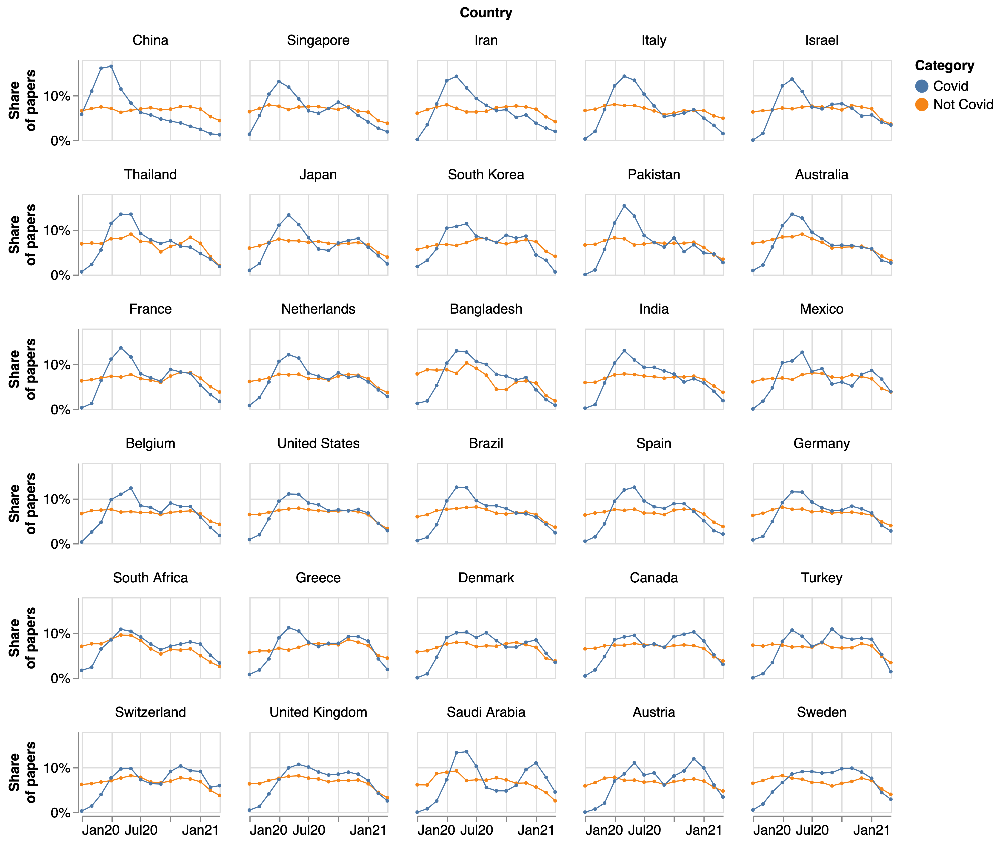{#fig:country_trend}

These international differences in the dynamics of the response to the pandemic might have partly been shaped by the research specialisation of different countries: if a country is focused on research topics that take longer to yield results, or that became salient later in the pandemic, this might explain why it took longer for the country to generate Covid-19 related research. We explore this idea by regressing the number of days since the beginning of the pandemic when a paper was published on whether a country was involved, the research cluster that the paper belongs to, and the number of institutions involved in the paper, which we take as a proxy of the complexity of the research (and the time it takes to publish it). 

The results, which we present in [@fig:country_reg], show that the results do not change substantially after we introduce controls for the research cluster where a paper sits, suggesting that the timing of national responses to the pandemic were not wholly driven by the research fields where different countries specialise. More research will be needed the role that other factors played in shaping the velocity of national responses to the pandemic.

{#fig:country_reg}
  
We also find some evidence of a positive association between the number of institutions participating in a publication and the time it takes to publish after we control for country and research area, consistent with the idea that incorporating collaborators into research projects makes them more complex and lengthier.  
 
### Comparative analysis of influence and collaboration

We conclude our analysis of preprints data by comparing research influence (proxied via citations) and collaboration sizes between comparable Covid-19 and non-Covid-19 projects published around the same time. This way, we seek to improve the evidence base about policy-relevant aspects of the research pandemic response, and to illustrate the potential value of semantic methods for generating control groups for comparative analyses.

In order to identify the control groups for Covid-19 papers in different research clusters we fit a Latent Dirichlet Allocation topic model with 150 topics on all preprints published between the first of March 2020 and first of September 2020. This yields a 150-element vector we can use to measure distances between papers. In this case, and following a similar strategy to what we described in [@sec:cordis], we calculate the median vector for all the articles in each of our research clusters and identify the 500 closest papers to that centroid in vector space. 

[@tbl:control_examples] presents randomly drawn examples in the Covid 'treatment' and control groups for each of the research clusters, suggesting that our semantic selection strategy is capturing research in non-Covid-19 adjacent domains to each of our research clusters. Our prior is that it is more meaningful to compare Covid-19 papers with others in this semantically similar group than with a randomly selected set in the wider arXiv corpus.

\small
| Research cluster             | Covid papers                                                                                                                                                                                                                 | Non Covid control papers                                                                                                                                                                                                                           |
|:------------------------------------------------:|:----------------------------------------------------------------------------------------------------------------------------------------------------------------------------------------------------------------|:-----------------------------------------------------------------------------------------------------------------------------------------------------------------------------------------------------------------------------------|
| Variants                     | Navigating the Dynamics of Financial Embeddings over Time                                                                                                                                                                    | Non-canonical proline-tyrosine interactions with multiple host proteins regulate Ebola virus infection                                                                                                                                           |
|                              |  SARS-CoV-2 genomics beyond the consensus sequence: evidence for circulating mixed viral populations                                                                                                                         |  Partitiviruses infecting Drosophila melanogaster and Aedes aegypti exhibit efficient biparental vertical transmission                                                                                                                           |
|                              |  SARS-CoV-2 in human sewage in Santa Catalina, Brazil, November 2019                                                                                                                                                         |  Quantitative analysis of the splice variants expressed by the major hepatitis B virus genotypes                                                                                                                                                 |
| Prediction                   | Evolution of the COVID Pandemic: A Technique for Mathematical Analysis of Data                                                                                                                                               | Deterministic Models in Epidemiology: From Modeling to Implementation                                                                                                                                                                            |
|                              |  Novel Spatiotemporal Feature Extraction Parallel Deep Neural Network for Forecasting Confirmed Cases of Coronavirus Disease 2019                                                                                            |  High burden of Mycoplasma genitalium and other reproductive tract infections among pregnant women in Papua New Guinea                                                                                                                           |
|                              |  Novel Spatiotemporal Feature Extraction Parallel Deep Neural Network for Forecasting Confirmed Cases of Coronavirus Disease 2019                                                                                            |  Population genomic molecular epidemiological study of macrolide resistant Streptococcus pyogenes in Iceland,1995-2016: Identification of a large clonal population with a pbp2x mutation conferring reduced in vitro beta-lactam susceptibility |
| Detection Sequencing         | SARS-CoV-2 in wastewater treatment plants                                                                                                                                                                                    | Measuring reading ability in the web-browser with a lexical decision task                                                                                                                                                                        |
|                              |  ENVIRONMENTAL SAFETY EVALUATION OF THE PROTECTION AND ISOLATION SYSTEM FOR PATIENTS WITH COVID-19.                                                                                                                          |  Laboratory sprayer for testing of microbial biocontrol agents: design and calibration                                                                                                                                                           |
|                              |  The Infectious Nature of Patient-Generated SARS-CoV-2 Aerosol                                                                                                                                                               |  Goos-H\"anchen Shifts in Gapped Graphene subject to External Fields                                                                                                                                                                             |
| Serology                     | The Prevalence of Antibodies to SARS-CoV-2 Among Blood Donors in China                                                                                                                                                       | Evaluation of the Point of Care Molecular Diagnostic Genedrive HCV ID Kit for the detection of HCV RNA in clinical samples.                                                                                                                      |
|                              |  Performance verification of detecting COVID-19 specific antibody by using four chemiluminescence immunoassay systems                                                                                                        |  DNA from dried blood spots yields high quality sequences for exome analysis                                                                                                                                                                     |
|                              |  IgG serology in health care and administrative staff populations from 7 hospital representative of different exposures to SARS-CoV-2 in Lombardy, Italy                                                                     |  Upper arm length along with mid-upper arm circumference to enhance wasting prevalence estimation and diagnosis : sensitivity and specificity in 6 to 59 month-old children.                                                                     |
| Airborne                     | Reusable Gowns for routine use in hospital and laboratory: a necessity arising of COVID-19 Pandemic                                                                                                                          | In vetro study on the toxic effects of acrylamide on blood antioxidants, ameliorative effects of vitamin C                                                                                                                                       |
|                              |  In Vitro Inactivation of Human Coronavirus by Titania Nanoparticle Coatings and UVC Radiation: Throwing Light on SARS-CoV-2                                                                                                 |  Melting and crystallization in layered film system Ge-Bi                                                                                                                                                                                        |
|                              |  Homegrown Ultraviolet Germicidal Irradiation for Hospital-Based N95 Decontamination during the COVID-19 Pandemic                                                                                                            |  RapidBrachyMCTPS 2.0: A Comprehensive and Flexible Monte Carlo-Based                                                                                                                                                                            |
|                              |                                                                                                                                                                                                                              |   Treatment Planning System for Brachytherapy Applications                                                                                                                                                                                       |
| Patient Impact               | Feasibility of non-invasive nitric oxide inhalation in acute hypoxic respiratory failure: potential role during the COVID-19 pandemic                                                                                        | Predicting deseasonalised serum 25 hydroxy vitamin D concentrations in the D-Health Trial: an analysis using boosted regression trees                                                                                                            |
|                              |  Lung Ultrasound Findings in Patients Hospitalized with Covid-19                                                                                                                                                             |  Efficacy and safety of decompressive craniectomy with non-suture duraplasty in patients with traumatic brain injury                                                                                                                             |
|                              |  A note on 'Collider bias undermines our understanding of COVID-19                                                                                                                                                           |  Machine learning algorithm for mortality prediction in patients with advanced penile cancer                                                                                                                                                     |
|                              |   disease risk and severity' and how causal Bayesian networks both expose and                                                                                                                                                |                                                                                                                                                                                                                                                  |
|                              |   resolve the problem                                                                                                                                                                                                        |                                                                                                                                                                                                                                                  |
| Population Impact            | Rapid assessment of the impact of lockdown on the COVID-19 epidemic in Portugal                                                                                                                                              | Correction of Daily Positivity Rates for contribution of various test protocols being used in a pandemic.                                                                                                                                        |
|                              |  Bayesian Spatio-Temporal Modeling of COVID-19: Inequalities on Case-Fatality Risk                                                                                                                                           |  Optimal Control of Joint Multi-Virus Infection and Information Spreading                                                                                                                                                                        |
|                              |  Estimating COVID-19 Prevalence in the United States: A Sample Selection Model Approach                                                                                                                                      |  Reactivation of latent infections with migration shapes population-level disease dynamics                                                                                                                                                       |
| Repurposed Treatments        | Efficacy and Safety of Lopinavir/Ritonavir for Treatment of COVID-19: A Systematic Review and Meta-Analysis                                                                                                                  | Late immune-related adverse events in long-term responders to PD-1/PD-L1 checkpoint inhibitors: a multicentre study.                                                                                                                             |
|                              |  Neuropsychiatric adverse events of chloroquine: A real-world pharmacovigilance study using the FAERS database                                                                                                               |  Impact of the adjustment of stratification factors on time-to-event                                                                                                                                                                             |
|                              |  Dual-Histamine Blockade with Cetirizine - Famotidine Reduces Pulmonary Symptoms in COVID-19 Patients                                                                                                                        |   analyses                                                                                                                                                                                                                                       |
|                              |                                                                                                                                                                                                                              |  Early antiparasitic treatment prevents progression of Chagas disease: Results of a long-term cardiological follow-up study in a pediatric population                                                                                            |
| Vaccines                     | Optimize Clinical Laboratory Diagnosis of COVID-19 from Suspect Cases by Likelihood Ratio of SARS-CoV-2 IgM and IgG antibody                                                                                                 | Performance characterization of PCR-free whole genome sequencing for clinical diagnosis                                                                                                                                                          |
|                              |  Anti-SARS-CoV-2 IgG antibodies are associated with reduced viral load                                                                                                                                                       |  Evaluation of staA, viaB and sopE genes in Salmonella detection using conventional polymerase chain reaction (PCR)                                                                                                                              |
|                              |  Quantifying antibody kinetics and RNA shedding during early-phase SARS-CoV-2 infection                                                                                                                                      |  One in seven pathogenic variants can be challenging to detect by NGS: An analysis of 450,000 patients with implications for clinical sensitivity and genetic test implementation                                                                |
| Lockdown Social Distancing   | Dynamics of SARS-CoV-2 with Waning Immunity in the UK Population                                                                                                                                                             | Sovereign Default Risk and Credit Supply: Evidence from the Euro Area                                                                                                                                                                            |
|                              |  Are countries precautionary actions against COVID-19 effective? An assessment study of 175 countries worldwide                                                                                                              |  Incorporating human mobility data improves forecasts of Dengue fever in Thailand                                                                                                                                                                |
|                              |  Public policy and economic dynamics of COVID-19 spread: a mathematical modeling study                                                                                                                                       |  Immunization Strategies in Networks with Missing Data                                                                                                                                                                                           |
| Education                    | Evidence-based, cost-effective interventions to suppress the COVID-19 pandemic: a rapid systematic review                                                                                                                    | Finding the Resistance Distance and Eigenvector Centrality from the                                                                                                                                                                              |
|                              |  Containing the Spread of Infectious Disease on College Campuses                                                                                                                                                             |   Network's Eigenvalues                                                                                                                                                                                                                          |
|                              |  Remote health monitoring and diagnosis in the time of COVID-19                                                                                                                                                              |  Using Hawkes Processes to model imported and local malaria cases in near-elimination settings                                                                                                                                                   |
|                              |                                                                                                                                                                                                                              |  VIRAL MUTATIONS AS A POSSIBLE MECHANISM OF HIDDEN IMMUNIZATION AND CONTAINMENT OF A PANDEMIA                                                                                                                                                    |
| Vaccination Programmes       | Clinical and Radiological Evaluations of COVID-19 Patients with Anosmia: Preliminary Report.                                                                                                                                 | Conclusive Identification of Senescent T Cells Reveals Their Abundance in Aging Humans                                                                                                                                                           |
|                              |  Use of Available Data To Inform The COVID-19 Outbreak in South Africa: A                                                                                                                                                    |  Exploring Connections Between Cosmos & Mind Through Six Interactive Art                                                                                                                                                                         |
|                              |   Case Study                                                                                                                                                                                                                 |   Installations in "As Above As Below"                                                                                                                                                                                                           |
|                              |  The importance of supplementary immunisation activities to prevent measles outbreaks during the COVID-19 pandemic in Kenya                                                                                                  |  Potential strategies for strengthening surveillance of lymphatic filariasis in American Samoa after mass drug administration: targeting older age groups, hotspots, and household members of infected persons                                   |
| Impact Studies               | SARS-CoV-2 infection induces a pro-inflammatory cytokine response through cGAS-STING and NF-?B                                                                                                                               | Zika viral proteome analysis reveals an epitope cluster within NS3 helicase as a potential vaccine candidate: an in silico study                                                                                                                 |
|                              |  6-Thioguanine blocks SARS-CoV-2 replication by inhibition of PLpro protease activities                                                                                                                                      |  Integrating genotypes and phenotypes improves long-term forecasts of seasonal influenza A/H3N2 evolution                                                                                                                                        |
|                              |  The neuropeptides VIP and PACAP inhibit SARS-CoV-2 replication in monocytes and lung epithelial cells and decrease the production of proinflammatory cytokines in infected cells.                                           |  Decomposing Polyclonal Sera using Neutralization Maps                                                                                                                                                                                           |
| Detection Diagnosis          | Phenol-chloroform-based RNA purification for detection of SARS-CoV-2 by RT-qPCR: comparison with automated systems                                                                                                           | Leptospira spp. seroprevalence in humans involved in a cross-sectional study in Garissa and Tana River Counties, Kenya                                                                                                                           |
|                              |  Development and Validation of Two In-house, Low-Cost SARS-CoV-2 Detection Assays                                                                                                                                            |  Reference genes for gene expression analysis in the fungal pathogen Neonectria ditissima and their use demonstrating expression up-regulation of candidate virulence genes                                                                      |
|                              |  Molecular detection of SARS-CoV-2 using a reagent-free approach                                                                                                                                                             |  Personalized in-silico drug response prediction based on the genetic landscape of muscle-invasive bladder cancer                                                                                                                                |
| Impact Studies 2             | SARS-CoV-2 infection of African green monkeys results in mild respiratory disease discernible by PET/CT imaging and prolonged shedding of infectious virus from both respiratory and gastrointestinal tracts                 | Concerns with the use of imputation to assign HLA allele-level typing in research predicting transplant outcomes                                                                                                                                 |
|                              |  Antiviral treatment of SARS-CoV-2-infected hamsters reveals a weak effect of favipiravir and a complete lack of effect for hydroxychloroquine                                                                               |  Immune molecular profiling of a multiresistant primary prostate cancer with a neuroendocrine-like phenotype                                                                                                                                     |
|                              |  Association of D-dimer and fibrinogen magnitude with hypercoagulability by thromboelastography in severe COVID-19                                                                                                           |  Calprotectin modulates inflammatory collateral tissue damage during intraperitoneal origin systemic candidiasis                                                                                                                                 |
| Genetic Analysis             | Coronavirus genomes carry the signatures of their habitats                                                                                                                                                                   | Dendritic cells focus CTL responses toward highly conserved and topologically important HIV epitopes                                                                                                                                             |
|                              |  SS3D: Sequence similarity in 3D for comparison of protein families                                                                                                                                                          |  Patterns of IgM Binding to Tumor-Associated Antigen Peptides Correlate with the Type of Brain Tumors                                                                                                                                            |
|                              |  Dynamical asymmetry exposes 2019-nCoV prefusion spike                                                                                                                                                                       |  A Nanoluciferase biosensor to investigate endogenous chemokine secretion and receptor binding.                                                                                                                                                  |
| Healthcare                   | Changes in health and functioning of care home residents over two decades: what can we learn from population based studies?                                                                                                  | Genome-wide Analysis of Copy Number Variation in Latin American Parkinson's Disease Patients                                                                                                                                                     |
|                              |  The impact of early scientific literature in response to COVID-19: a scientometric perspective                                                                                                                              |  The Bacterial and Viral Complexity of Postinfectious Hydrocephalus in Uganda                                                                                                                                                                    |
|                              |  Triaging of Respiratory Protective Equipment on the assumed risk of SARS-CoV-2 aerosol exposure in patient-facing healthcare workers delivering secondary care: a rapid review                                              |  Bio-Impedance Spectroscopy: Basics and Applications                                                                                                                                                                                             |
| Impact Studies 3             | In vivo demonstration of microvascular thrombosis in severe Covid-19                                                                                                                                                         | iPSC-derived hepatocytes from patients with nonalcoholic fatty liver disease display a disease-specific gene expression profile                                                                                                                  |
|                              |  Angiotensin-(34) modulates angiotensin converting enzyme 2 (ACE2) downregulation in proximal tubule cells due to overweight and undernutrition: implications regarding the severity of renal lesions in Covid-19 infection |  Python nidoviruses, more than respiratory pathogens                                                                                                                                                                                             |
|                              |  Cellular exocytosis gene (EXOC6/6B): a potential molecular link for the susceptibility and mortality of COVID-19 in diabetic patients                                                                                       |  Computational prediction of drug response in short QT syndrome type 1 based on measurements of compound effect in stem cell-derived cardiomyocytes                                                                                              |
| Smoking Cancer               | Angiotensin Converting Enzyme Inhibitors and Angiotensin Receptor Blockers and Outcome of COVID-19 : A Systematic Review and Meta-analysis                                                                                   | Combination of ipratropium bromide and salbutamol in children and adolescents with asthma: a meta-analysis                                                                                                                                       |
|                              |  Cancer inpatient with COVID-19: a report from the Brazilian National Cancer Institute                                                                                                                                       |  Gut microbiota features on nursing home admission are associated with subsequent acquisition of antibiotic resistant organism colonization                                                                                                      |
|                              |  Estrogen and COVID-19 symptoms: associations in women from the COVID Symptom Study                                                                                                                                          |  Respiratory Syncytial Virus in Infants and Children with Prader-Willi syndrome.                                                                                                                                                                 |
| Social Media                 | E-Quarantine: A Smart Health System for Monitoring Coronavirus Patients                                                                                                                                                      | Governance of the Internet of Things (IoT)                                                                                                                                                                                                       |
|                              |   for Remotely Quarantine                                                                                                                                                                                                    |  The prevalence of Angiostrongylus cantonensis in rodent hosts in China and several Asian countries: a systematic review and meta-analysis                                                                                                       |
|                              |  Social Media Reveals Psychosocial Effects of the COVID-19 Pandemic                                                                                                                                                          |  Do journals flipping to Gold Open Access show an OA Citation or                                                                                                                                                                                 |
|                              |  CovidCounties - an interactive, real-time tracker of the COVID-19 pandemic at the level of US counties                                                                                                                      |   Publication Advantage?                                                                                                                                                                                                                         |
| Lockdown Social Distancing 2 | Estimating the Fraction of Unreported Infections in Epidemics with a Known Epicenter: an Application to COVID-19                                                                                                             | The role of socioeconomic status, environment, and temperature in the spatio-temporal distribution of the first Chikungunya epidemic in the city of Rio de Janeiro, Brazil                                                                       |
|                              |  The Estimated Time-Varying Reproduction Numbers during the Ongoing Epidemic of the Coronavirus Disease 2019 (COVID-19) in China                                                                                             |  An unsupervised algorithm for host identification in flaviviruses                                                                                                                                                                               |
|                              |  Protection after Quarantine: Insights from a Q-SEIR Model with Nonlinear Incidence Rates Applied to COVID-19                                                                                                                |  Reactivation of latent infections with migration shapes population-level disease dynamics                                                                                                                                                       |
| Image Detection              | Combining PCR and CT testing for COVID                                                                                                                                                                                       | STAN-CT: Standardizing CT Image using Generative Adversarial Network                                                                                                                                                                             |
|                              |  Automatic X-ray COVID-19 Lung Image Classification System based on Multi-Level Thresholding and Support Vector Machine                                                                                                      |  Topological Descriptors for Parkinson's Disease Classification and                                                                                                                                                                              |
|                              |  A Fully Automated Deep Learning-based Network For Detecting COVID-19 from a New And Large Lung CT Scan Dataset                                                                                                              |   Regression Analysis                                                                                                                                                                                                                            |
|                              |                                                                                                                                                                                                                              |  Normalizing single-cell RNA sequencing data with internal spike-in-like genes                                                                                                                                                                   |
| Trials                       | A Comparative Study of Target Reconstruction of Ultra-High-Resolution CT for Patients with Corona-Virus Disease 2019 (COVID-19)                                                                                              | Characterizing the Clinical and Genetic Spectrum of Polycystic Ovary Syndrome in Electronic Health Records                                                                                                                                       |
|                              |  Cell-based therapies for COVID-19: A living systematic review                                                                                                                                                               |  Linguistic evolution driven by network heterogeneity and the Turing                                                                                                                                                                             |
|                              |  Considering indirect benefits is critical when evaluating SARS-CoV-2 vaccine candidates                                                                                                                                     |   mechanism                                                                                                                                                                                                                                      |
|                              |                                                                                                                                                                                                                              |  Real Time Investigation of a large Nosocomial Influenza A Outbreak Informed by Genomic Epidemiology                                                                                                                                             |
: Example papers in the Covid research cluster and semantic control groups {#tbl:cov_comp}

\normalsize

We create, for each of our research clusters, a combined dataset with Covid-19 and 'semantic' control papers and, in each of them, regress citation counts and number of participating countries on an index variable for whether the paper is in the Covid-19 cluster or in the semantic control group and an additional control for the month when a paper was published to account for differences in the exact timing of publication across papers.^[Since we are working with skewed count data (citation counts and number of participants in a project), we respectively use a Zero Inflated Poisson model anda Poisson model fopr the regresssions [@lee2007depth, @bornmann2018normalization].] [@fig:reg_plots] presents the results. 

Perhaps unsurprisingly, Covid-19 related papers tend to be more influential than similar non-Covid-19 papers in most research clusters (although we note the wide confidence intervals). On the other hand, Covid-19 papers tend to involve fewer international collaborations, consistent with the idea that fast-moving researchers sought collaborators locally early in the pandemic, and perhaps also that some Covid-19 research requires local data and knowledge favouring geographically circumscribed collaborations.

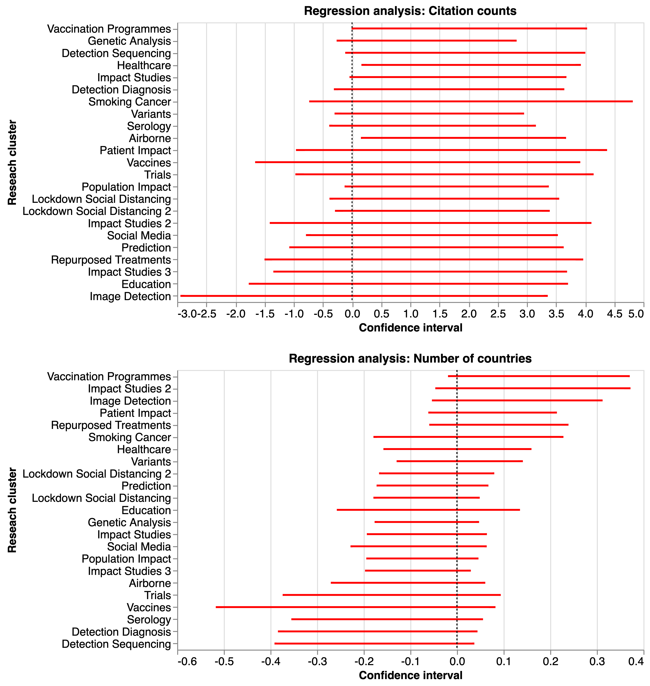{#fig:reg_plots}

The results that we have presented in this subsection illustrate the potential of semantic methods as tools for comparative analyses that could yield policy-relevant implications - in this case, identifying pandemic research areas with lower than expected levels of international collaboration where targeted networking interventions could prove particularly valuable.

## Funder benchmarking {#sec:funder}

We conclude our analysis with an experimental semantic comparison between the Covid-19 related funding portfolios of three research funders  - the European Commission, UKRI and the Wellcome Trust. Our goal is to illustrate the potential of these methods to provide insights about the research focus of different institutions during the pandemic, potentially helping to identify complementarities and gaps in their activities.

Our starting point is an integrated dataset that contains information about research funding activities from the European Commission (obtained via CORDIS), the Gateway to Research (obtained from the Gateway to Research) and Wellcome Trust (from its open grant database) and which we analyse to identify projects that mention explicitly terms related to Covid-19. This yields a dataset with 2,119 UKRI projects (with a total budget o €510 million), 190 EC projects (wuth a total budget of €657 million) and 89 Wellcome projects (with a total budget of €77 million). We note that UKRI projects are on average much smaller than EC and Wellcome Trust projects with an average budget of €246,000 per project compared with €870,000 in the case of Wellcome and €3.4 million in Commission funded projects. These differences might be explained by the target audiences for research grants as well as the number of participants in research consortia - this is not, in any case the focus of our analysis, which will instead concentrate on the topical focus in each of these funder's portfolios.

We leverage the relative small size of the corpus to implement an experimental strategy to ensure topic robustness. This entail fitting a topic model in the data multiple times (30 in our case) and clustering topics across runs based on their distribution over documents. Those topics that are identified in the data in more instances (i.e. which are grouped into clusters with more members) could be considered to be more robust (i.e. likely to be generated by our topic model independently from individual runs). In our case, the ensemble of topic runs yields 2,430 topics that are consolidated into 162 robust topics after we cluster them and filter out those with less than two members. We then compare the topic distributions across funders using the same regression approach implemented in previous sections of this report.

[@fig:funder_topic] highlights interesting differences between the profiles of the research funders we are considering: the European Commission and Wellcome Trust are more focused on health / genetic research, biology and humanities topics while UKRI is relatively specialised in research on industrial, environmental and digital (including distant communication and collaboration) subjects which could help to mitigate the indirect effects of the pandemic or prepare for 'rebuilding' efforts afterwards.

These differences highlight many opportunities for knowledge sharing and collaboration between countries supporting different streams of research and innovation to fight the pandemic and tackle its effects.

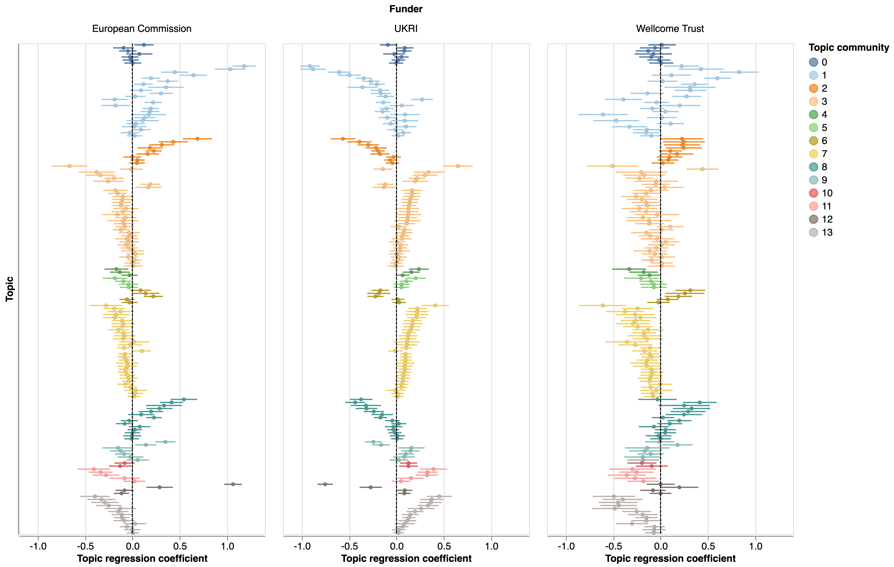{#fig:funder_topic}

## OpenAIRE analysis {#sec:openaire}

## Conclusion {#sec:covid_conclusion}

In this section we have reported the results of a semantic analysis of the R&D response to the Covid-19 pandemic using state-of-the-art  unsupervised machine learning, natural language processing and network analysis techniques. We implemented various methods to enhance the robustness of our results involving ensemble methods and benchmarking, and statistical comparisons between groups that provide measures of uncertainty about our estimates. We have presented extensive random (non-cherrypicked) examples of our results suggesting that the methods that we have developed add informative structure to the data despite its complexity. 

We have developed various indicators about level of national participation in funding and research activities related to the pandemic, as well as levels of pandemic preparedness based on existing capabilities and national and regional specialisation in various Covid-19 research themes. These indicators raise as many questions as they answer regarding international differences in levels of participation in research efforts to tackle the pandemic, as well as the sequence and geographical distribution of activity in various Covid-19 related research clusters - answering these questions will require integrating the indicators with subject and policy knowledge beyond our area of expertise.  We hope that these indicators will act as an input for future analysis to improve our understanding of these questions in ways that could inform the development of stronger R&I systems and societies. 

Going beyond this, our comparative analysis of Covid-19 research papers with a set of semantic control groups suggests that natural language processing methods might have a use role to play benchmarking research activities to inform policy interventions. Our topic analysis of the EC response to the pandemic and of various research funder portfolios highlights the potential of these methods to generate indicators of R&I activity at the funder / institutional level that can inform collaboration and knwoledge sharing. 

# Validation {#sec:val}

The development of EURITO indicators has involved an interative cycle of quantitative validation using quantitative methods that we have outlined in previous sections, such as the use of training and test sets and creation of new labelled datasets in the case of the SDG indicators in [@sec:sdg] and the implementation of various ensemble techniques and robustness tests with the unsupervised methods and relatedness analyses in [@sec:covid]. We have discussed emerging findings from the analysis of these indicators and gathered views from policy and research experts in a variety of venues. In addition to this, the project includes a formal validation stage that has the goal of making explicit the strengths and weaknesses of the indicator production process and to explore the consistency of the indicator results with external sources,  and which was undertaken by consortium members who had not participated directly in the production of the indicators. 

This implies an assessment of:

1. The statistical quality of the indicator production process
2. The relevance for the end users and society of the knowledge generated,
3. The consistency of the results with external sources that track the response of science, technology and innovation (STI) activity to COVID-19.

The conceptual framework for the entire validation stage is adapted from the Quality Assurance Framework V 2.0 (QAF) of the European Statistical System (ESS) (European Statistical System, 2019), based upon the European Statistics Code of Practice (CoP) [@ess2019qa, @eurostat2017cop]. According to this framework, quality is a multi-faceted concept that affects all aspects of the operation of a process, covering not only the statistical outputs, but also the statistical processes that produce them and the environment in which the statistical system develops.

The ESS-QAF includes 17 principles of statistical quality organized in three pillars: institutional environment (principles 1 - 6), statistical processes (principles 7 - 10) and statistical output (principles 11 - 15). The first pillar and principles 9 and 10 of the second pilar relate to the institutional activities of national statistical agencies and are thus less relevant for the EURITO project. 

For this reason, we focus the validation exercise on principles 7, 8, 11, 12, 13, 14 and  15, checking the degree of compliance of EURITO's indicators and their production with the relevant principles Deliverable 

[To_add deliverable number] provides a detailed rationale for EURITO's scores against relevant principles, which we also summarise here (see [tbl:val_assm]).

In overall terms, we conclude that the degree of compliance of the EURITO project with the QAF-ESS principles of statistical output is medium-high. The justification for this score is that:

1. The views of experts and users have been taken into account and explicitly incorporated in the statistical processes through scoping and validation activities in the first phase of the project and during the latter phase of the Covid-19 pivot. There have been procedures to systematically consult users. The project is considered to meet users' needs.
2. The data sources and methods deployed are innovative and go beyond conventional approaches, while putting in place checks to assess and ensure the statistical quality of the outputs. The methodology adopted is innovative and rigorous and entails the intensive use of textual analysis and machine learning techniques. The resulting indicators are timely.
3. The methodology appropriately tackles robustness issues and provides measures of uncertainty regarding the indicators. One limitation of the project is the low comparability of some statistics and indicators over time, in particular those related to the Covid R&I response since the pandemic appears to have a break in the use of open science venues for the dissemination of research results. However, this limitation is in part a necessary consequence of the phenomenon under study.

EURITO indicators and methodology have been distributed through reports, working papers and peer-reviewed datasets, open datasets and interactive visualisations. All EURITO code is openly available for others to inspect and build on at [http://www.github.com/nestauk/eurito_indicators](http://www.github.com/nestauk/eurito_indicators).

|Principle                                     | Score |
|----------------------------------------------|-------|
| **Principle 7: Sound methodology**                        |
| |
|    7.1: The overall methodological framework used for European Statistics follows European and other international standards, guidelines, and good practices, while constantly striving for innovation | High |
|    7.2: Procedures are in place to ensure that standard concepts, definitions, classifications and other types of standards are consistently applied throughout the statistical authority | High |
|**Principle 8: Statistical Procedures** |
| |
|    8.1: When European Statistics are based on administrative and other data, the definitions and concepts used for non-statistical purposes are a good approximation to those required for statistical purposes | Medium-High |
|    8.3: Statistical processes are routinely monitored and revised as required. | High |
|**Principle 11: Relevance** |
| |
|    11.1: Procedures are in place to consult users, to monitor the relevance and value of existing statistics in meeting their needs, and to consider and anticipate their emerging needs and priorities. Innovation is pursued to continuously improve statistical output. | High |
|    Indicator 11.2: Priority needs are being met and reflected in the work programme. | High |
|    Indicator 11.3: User satisfaction is monitored on a regular basis and is systematically followed up. | Medium |
|**Principle 12: Accuracy & Reliability** |
| |
|    12.1: Source data, integrated data, intermediate results and statistical outputs are regularly assessed and validated | Medium-high |
|**Principle 13: Punctuality & Timely indicators** |
| |
|    13.1: Timeliness meets European and other international release standards. | Medium-high |
|    13.5: Preliminary results of acceptable aggregate accuracy and reliability can be released when considered useful.  | Medium-high |
|**Principle 14: Coherence & comparability** |
| |
|    14.1: Statistics are internally coherent and consistent (i.e. arithmetic and accounting identities observed). | Medium-high |
|    14.2: Statistics are comparable over a reasonable period of time.  | Low |
|    14.3: Statistics are compiled on the basis of common standards with respect to scope, definitions, units and classifications in the different surveys and data sources  | Medium-high |
|    14.4: Statistics from different data sources and with different periodicity are compared and reconciled   | High |
|**Principle 15: Accessibility** |
| |
|    15.1: Statistics and the corresponding metadata are presented, and archived, in a form that facilitates proper interpretation and meaningful comparisons. | High |
|    15.2: Dissemination services use modern information and communication technology, methods, platforms and open data standards.  | High |
|    15.4: Access to microdata is allowed for  | High |
|    Users are kept informed about the methodology of statistical processes including the use and integration of administrative and other data.   | High |
|    15.7: Users are kept informed about the quality of statistical outputs with respect to the quality criteria for European Statistics. | High |
: Overall Summary of the validation of compliance. ESS-QAF Principles 7-8 and 11-15 {#tbl:val_assm}

# Outputs {#sec:outputs}

All of the activities described above yield the following dissemination outputs:

* A collection of indicators about the evolution and geography of Artificial Intelligence research, EC funding activity related to the sustainable development goals and R&I activities related to Covid-19. Where possible, these indicators are distributed at the national level and multiple subnational levels (NUTS1, NUTS2 and NUTS3) helping to inform detailed analyses of geographical clustering in the R&I activities being measured. These indicators are available in tabular format from the [EURITO GitHub repository](http://www.github.com/eu_indicators) and the EURITO dashboard to be launched in fall 2021. The indicators are documented using a YAML schema.
* Enriched micro-datasets that may be of interest to policymakers such as individual H2020 projects tagged with SDG goals and Covid-19 preparedness levels. 
* An accessible, responsive and interactive dashboard that can be used to explore R&I indicators. In addition to those indicators developed in the project, the dashboard also includes Eurostat indicators related to innovation which have a detailed geographical dimensions (the tool will be launched in September 2021).
* All the source code (written in Python) used to collect, process and enrich the data used in the project and to produce the indicators and visualisation frontend.

# Organisational implications {#sec:org}

Based on a model of a two-sided market for innovation indicators developed and presented in D4.5, a set of organisational implications have been derived and presented in D5.4.. In the following, we present a summary of the implications differentiated into the demand and supply side, but also related to the externalities between the two of them and the regulatory framework conditions. Finally, Covid-19 has not only consequences for innovation policy, but also on innovation indicators. We also consider the feedback we have received during the final workshop on July 26th 2021.  

Regarding the implications relevant for the organisations at the demand side, which are mainly policy makers being responsible for R&I policies, we recommend to reduce the cycles of updating the Oslo Manual, which lasted 13 years from the 3rd to the current 4th edition. In addition, the focus on survey-based approach in the Oslo Manual should be widened to consider the data sources and methodologies investigated during EURITO, but also other related efforts, e.g. in the indicators projects funded by the Federal Ministry of Education and Research in Germany. Finally, the process of updating the Oslo Manual should be more transparent to benefit from the knowledge of the various stakeholders involved in the development of innovation indicators.

Since the negotiation process related to the update of the Oslo Manual is quite complicated and lengthy, countries could also go for bi- or multilateral co-operations related to the establishment of new indicators, which can then be fed into the OECD level at a later stage.

Policy makers responsible for R&I should consider during the phase of developing new R&I policies, like the mission-oriented innovation policy, already the needs for  new indicators. 

In order to assure an absorptive capacity,  ministries or organisations being responsible for R&I policies should establish an organisational unit explicitly responsible for innovation indicators, which might be liaised with the domestic statistical office. It should have a critical mass of staff with the relevant skills, which have to be timely updated. If these units collect and process data by themselves, they should be equipped with the necessary IT hard- and software. Regarding the performance of R&D programmes, innovation indicators should be considered from the very beginning of the R&I policy life cycle and not only towards the end, when the evaluation of these programmes take place. Finally, units responsible for innovation indicators are launching  public procurement processes. Here, it is recommended that within countries, but also across countries common definitions of the innovation indicators are implemented, e.g. following the Oslo Manual or other internationally or at least EU-wide accepted guidelines. Finally, the indicators, but also the related raw, data should be accessible open access both for other users, e.g. R&I policy makers, but also organisations developing innovation indicators.

However, we derived not only implications for the demand side, but also for the actors at the supply side. To improve the efficiency of the market of innovation indicators, they might consider making at least part of their data available open access. Complementary to the data, open source software might be used, but also contributed to, e.g. on GitHub, for processing the data. This might increase both their productivity by saving labour costs, but also the reliability and consequently the trust in their used methodologies. From a conceptual perspective, joining networks with academics having expertise in innovation research and policy will contribute to a better theoretical base or frame for the development of innovation indicators. Closer collaboration with Higher Education Institutes, including common lecture series, might be an effective approach to address the skill shortage of data scientists. Finally, a close monitoring of the needs at demand side, e.g. related to upcoming new R&I policies, might allow a timely development of related innovation indicators. The increased complexity of innovation indicators might be compensated by an attractive visualisation of the data and indicators. Overall, the supply side should be not only technology, but in particular demand driven to be successful in establishing new innovation indicators.

The demand side in the market of innovation indicators, i.e. the policy makers and agencies, is able to generate strong externalities on the supply side. It has the chance to find an efficient balance between existing and new indicators in their funding decisions, i.e. it is also inefficient to substitute too fast already established indicators by new indicators. Big data based start-ups might also become new players at the supply side, which could be supported by specific funding policies of the demand side. The demand side can even invite the supply side to the  common development of new indicators, e.g. via two stage public procurement processes, but can even use crowdsourcing, e.g. via hackathons, to collect new ideas, data and methodologies for the development of innovation indicators.

The supply side also has opportunities to generate positive externalities on the demand side, however to a lesser extent than the latter. In addition to the presentation of new opportunities; the validation of results based on new data sources by established data sources might be convincing for the demand side.Overall, new innovation indicators should be based on sound theories, methodologies and have to meet needs at the demand side.

Finally,  regulatory framework conditions can have implications on the availability and granularity of data being relevant for the construction of innovation indicators, e.g. e.g. the directives on Copyright in the Digital Single Market, Databases and Open Data and the General Data Protection Regulation. In the ex ante impact assessment, their relevance for innovation indicators have not been considered. Therefore, the upcoming Digital Markets Act, but also further regulations and directives should consider their implications on the accessibility of data relevant for the development of innovation indicators.   

Covid-19 required not only an increased agility of R&I policy, but might also have implications for the markets of innovation indicators, which has to be investigated. In addition to the need for the speedy provision of innovation data and indicators, the relevance and feasibility of additional indicators, e.g. related to sustainability or distribution aspects, but also related to technological sovereignty, have to be investigated, then integrated into the traditional set of innovation indicators and eventually included in the update of the OECD Oslo Manual. Finally, the demand side of innovation indicators in general, but in particular the provider of research grants should react timely to crises by allowing pivots in running research projects in close collaboration with the beneficiaries, like realised within the pivot of EURITO in coordination with the European Commission.

# Conclusions {#sec:conclusion}

# References

    