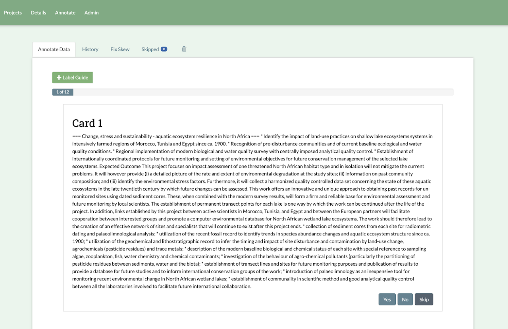
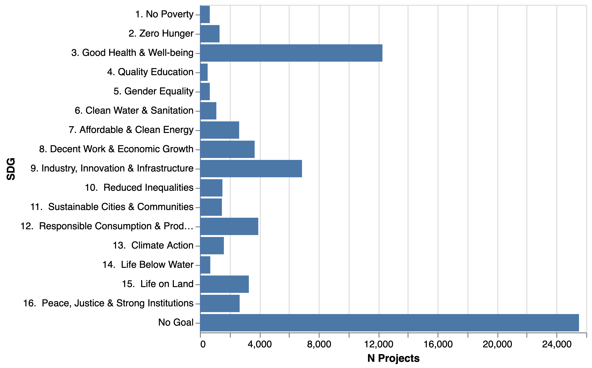
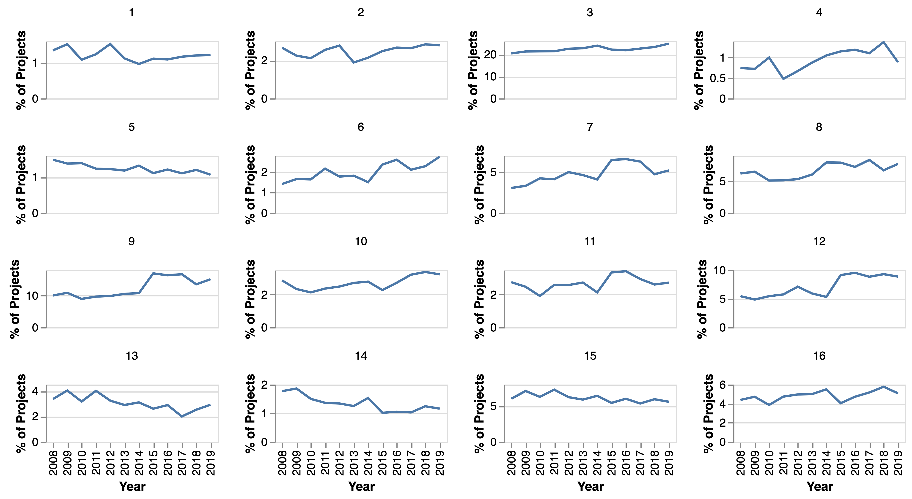
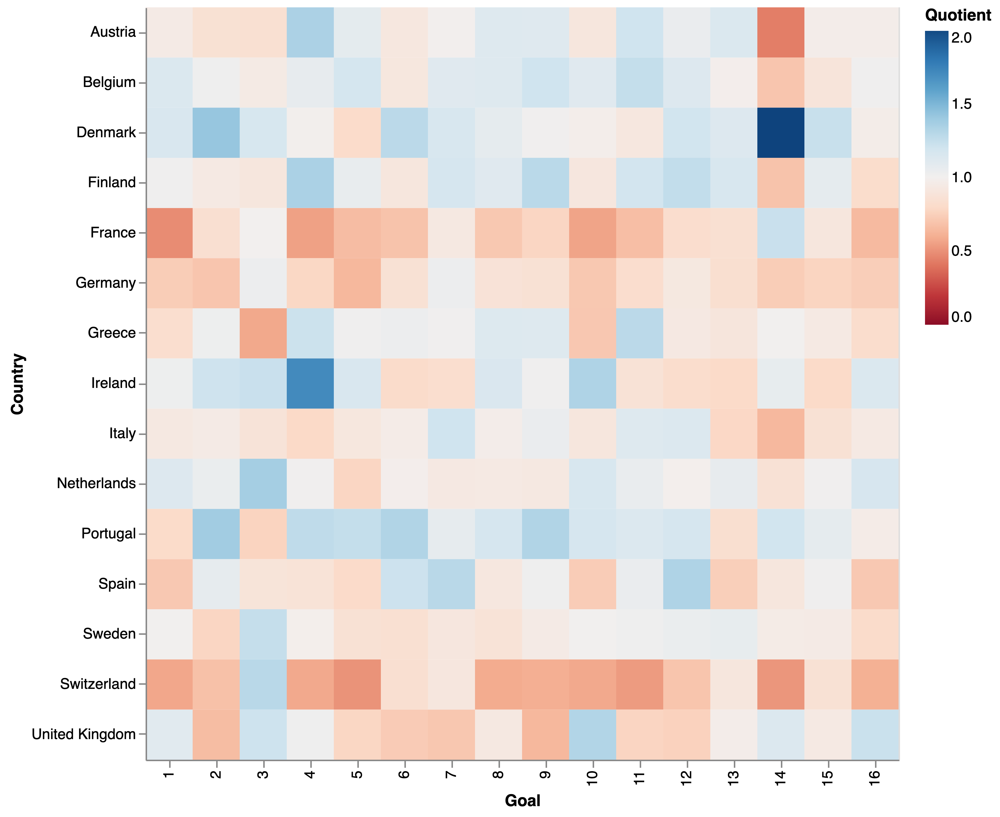

## Mapping research related to the Sustainable Development Goals {#subsec:sdg}

In our data science pilots we explored themes of diversity and mission oriented R&I. One emerging theme from the discussions and events around these pilots was the degree to which research funded by the European Commission was addressing broader issues of sustainability. Following this, we developed a programme of work focused on identifying and mapping research efforts related to the United Nations Sustainable Development Goals.

Social and environmental sustainability are covered by many competing definitions and frameworks that have emerged from a variety of geographic, political and policy settings. Sustainability itself is a highly contested term, yielding an array of interpretations depending on the individual or institution that invokes it. To make an attempt at mapping sustainability issues being tackled by R&I activities, we chose to use the framework offered by the United Nations Sustainable Development Goals (SDGs). This was mentioned specifically by stakeholders who attended our pilot events and also has the advantages that it is internationally recognised and agreed as one universal set of objectives for countries to achieve. The individual goals that it contains targets relate to a broad spectrum of sustainability dimensions and attempts are made to measure progress against these for the majority of countries on an annual basis [@sachs_sustainable_2021].

Many institutions, inlcuding the United Nations itself, have asserted the role that R&I can play in acheiving the Goals [@borowiecki_oecd_2019, @unstats_sustainable_2021, @nature_science_ sdgs_2021]. At the same time, researchers, particularly in the field of science and technology studies, have stressed the role of institutions in directing R&I efforts towards achieving concrete societal goals [@stirling_direction_nodate, @mazzucato_market_2016, @schot_three_2018]. In response, there are now a number of academic and commercial initiatives that aim to identify research activities that are related to the Goals [@armitage_mapping_2020, @science_contextualizing_2020, @jayabalasingham_identifying_2019, @duran-silva_controlled_2019, @strings_snapshot_2021]. Here, we describe our own attempt to map the research that is relevant to the SDGs, with specific attention paid to the European context and the values openness and trust that are centred in this programme of work. We will additionally present some analyses that highlight interesting aspects of the related research activity and draw comparisons between our approach and the existing initiatives.

The solution that we designed for identifying SDG related research relies on a supervised machine learning approach. Ultimately, we constructed a model that is trained to take the title and abstract of a project as inputs and predict whether the it is related to any of the first sixteen SDGs independently.[^1] In this way, the model attempts to detect whether a project is related to one Goal, several, or none at all. Several other pieces of work in this space aim to identify the goals using expert defined keywords or complicated boolean queries, however these can never exhaustively capture all of the concepts embedded within a complex concept such as a SDG and are highly sensitive to the vocabulary used in the set of terms [@armitage_mapping_2020]. State-of-the-art natural language processing (NLP) techniques on the other hand are able to infer the semantic meaning of words and phrases that are not included in the training data, meaning that the final algorithm is able to capture a more comprehensive range of expressions that may relate to one of the Goals.

[^1]: Our model was not trained to predict Goal 17. Partnerships for the Goals as it was considered that in the context of R&I, this related more to the operational and organisational characteristics of a project than the content of the project.

The capabilities of modern machine learning methods do not necessarily give licence to allow loose definitions of the concepts that are trying to be learned. It remains highly important to define the semantic space that captures the concepts of interest, as the initial attempt to create a classification model in this project demonstrates.

The first methodology that was tested used training data scraped from the web. Guided by the programme's aim to use novel data sources, we identified two websites that contained articles labelled with SDGs. The first of these was the RELX SDG Resource Centre which describes itself as a website that "showcases the latest in science, law, business, events and more that can help drive forward the SDGs" [@relx_about]. SDG Knowledge Hub by the International Institute for Sustainable Development, which describes itself as "an online resource center for news and commentary regarding the implementation of the United Nations’ 2030 Agenda for Sustainable Development and the Sustainable Development Goals (SDGs)" [@iisd_about]. On both sites, each article contains original or other content, including publication summaries, event descriptions, news items or policy highlights, with each item being tagged with one or more SDGs. We considered the combination of these two sites to offer a wide-ranging, curated source of labelled data. After scraping and filtering content (removing very short article stubs and articles tagged with more than 3 Goals) and their associated SDG labels from these websites, we obtained a dataset of over 10,000 labelled articles.

The two main components of the model built using the scraped training data were a transformer to encode the article texts as embeddings followed by an ensemble classifier trained on those embeddings with the SDG tags as the target variable. We subsequently applied the model to projects in the CORDIS database and carried out an evaluation exercise in which a balanced sample of around 100 positive and negative predictions were assessed for accuracy by one of the authors. The results that this yielded were not promising, with particularly poor performance on the precision of the predictions (many false positives arose). 

Closer manual inspection of samples of the training data and the prediction results suggested that this was happening primarily because of the nature of the training data. In particular, it appeared that on both sites the application of SDG tags was done eagerly and followed loose criteria, with little consistency or definition. For example, many articles were labelled with both 7. Clean and Affordable Energy and 13. Climate Action when reference to either clean energy or climate science or policy was made. While these two Goals certainly contain synergies, their official definitions refer to specific and distinct concepts. Similar patterns were spotted for other Goal pairs. In other cases, we identified articles that were related to one of the Goals in a very tangential manner. Finally, we found that the vocabulary and linguistic patterns used across much of the datasets were substantially different to those found in R&I project abstracts.

The challenges highlighted by this first iteration of our modelling methodology are typical of machine learning classification problems, particularly those with multiple, imbalanced and conceptually overlapping classes. However, such issues cannot be solved by purely technical tweaks. Attention must be paid to the context of the domain and how the results of the model might be used in order to define the classes and refine or reformulate the problem. We therefore set out to create a domain-specific, controlled dataset that abided by tighter definitions of the SDGs.

To create a new labelled dataset that follows these criteria, we used crowd sourcing to tag R&I projects from CORDIS with labels to indicate whether they were related to one of the SDGs. We hosted an instance of an open-source data annotation platform [@smart_github_2021] to create 16 datasets, each with positive and negative examples of projects related to one of the Goals. The interface of the platform, with an example project being labelled is shown in [@fig:smart_platform]. To ensure the quality and consistency of the annotation process, we made several choices:

1. We wrote codebooks to instruct annotators on how to label projects. This included definitions of the SDGs in the context of R&I, examples of positive and negative projects and examples of terms to pay attention to.
2. We recruited a team of 20 Nesta employees as annotators. This allowed us to maintain more control over the labelling process as opposed to relying on annotations from members of the public or commercial crowd annotation platforms. 
3. The annotators were split into 4 groups, with each team being responsible for labelling only a quarter of the SDGs. This allowed people to focus on learning the definitions of a smaller number of the Goals.
4. The annotation process was treated as 16 binary labelling exercises. After logging in to the platform, annotators would choose to label projects for just one of the Goals, tagging them with Yes or No depending on the percieved relationship to the Goal. This meant that annotators did not have to focus on more than one defintion of a Goal at any time.
4. 30 minute training sessions we run for annotators, to guide them through the process and the codebooks and field questions.
5. An instant messaging channel was used by annotators to discuss the projects that they were annotating with each other and the authors to determine the best choices in the face of ambiguities.

{#fig:smart_platform width=50%}

All of the steps above relied on determining a definition of the goals that is widely recognised, is relevant to a R&I policy audience and could be consistently applied by annotators. The headline titles of the Goals are not sufficient for this as they can be understood to cover a very broad range of topics. Indeed, this is one possible reason for the presence of many mislabelled articles in our original web-scraped training data. On the other hand, it is challenging to define a prior, exhaustive list of concepts that are both SDG related and relevant to R&I activities. For this reason, we chose to use the official and specific targets of each Goal as the basis for our definitions and allowed annotators to use their judgement. In our codebooks, we presented annotators with the narrow aims outlined by the targets and their conditions, and asked them to label projects positively if they referred explicitly or implicitly to at least one of them. In this way, we captured SDG related projects in a manner that was transparent, accepted and defined, without being overly restrictive. For the purpose of openness, the codebooks and annotated datasets are being made freely available in the GitHub repository of this project.

An additional challenge for the annotation process was to ensure that sufficient positive examples were present for each goal. Initial exploration of the CORDIS data showed that the presence of SDG related work in the R&I projects was highly imbalanced both between goals and with respect to non-related work. Rather than taking a random sample of projects to label, we took a multi-stage approach to ensure that the annotators had a more balanced dataset. First, we leveraged existing SDG keywords to create queries that identified projects containing those terms. We then created embeddings of all the project abstracts using a document encoder. The resultant vectors of encoding methods can be used to compare the semantic similarity of text with metrics such as the cosine distance. In this way, we identified documents that did not contain our keywords, but bore some semantic similarity to those that did. This has the additional benefit of broadening the search space that the annotators had to explore and find SDG related projects. Finally, we took a random sample of all remaining projects to ensure a sufficient number of negative examples. While this attempt to balance the data was succesful for including positive examples, the labelled datasets still displayed a wide range of imbalance across the goals, which is to some extent indicative of the presence of R&I related to these goals.

As with the initial modelling attempt, 16 binary classifiers were trained on the annotated datasets. The pipeline for each model consisted of a pre-trained BERT transformer[@devlin_bert_2019] to embed the project abstracts, followed by classification using XGBoost[@chen_xgboost_2016]. Transformers are state-of-the-art architectures for neural networks and are particularly well-suited to natural language processing. Pre-trained transformers are trained to learn linguistic patterns from large copora of text such as Wikipedia and can then be applied to other language based problems. One of their applications is to produce numeric vector representations of documents that embed a semantic representation of the text. These embeddings can then be used as features for machine learning models or analyses on aspects such as semantic similarity and coherence across documents. XGBoost is a model architecture that can be tuned to account for imbalances in dataests.

The results of the model on test datasets after cross validation are shown in [@tbl:sdg_classification_report] and can help us to understand the performance of the model. We can see that the F1 score for the projects predicted as related to the Goals ranges between 0.53 to for 9. Industry, Innovation & Infrastructure to 0.83 for 3. Good Health & Wellbeing. In all but one case, the recall of positive samples is higher then the precision, indicating that the classifiers have a tendency to learn broader definitions of the goals than those captured by the labelled data. We can also see that the F1 scores do not correlate exactly with the balance of the training datasets, suggesting that the relationship betwee R&I projects and some SDGs are intrinsically more difficult to learn for humans or machines.

| Goal                                      |   Precision Neg |   Recall Neg |   F1-Score Neg |   Support Neg |   Training % Neg |   Precision Pos |   Recall Pos |   F1-Score Pos |   Support Pos |   Training % Pos |
|:------------------------------------------|----------------:|-------------:|---------------:|--------------:|-----------------:|----------------:|-------------:|---------------:|--------------:|-----------------:|
| 1. No Poverty                             |            0.97 |         0.96 |           0.96 |           186 |            93.01 |            0.62 |         0.72 |           0.67 |            18 |             6.99 |
| 2. Zero Hunger                            |            0.95 |         0.86 |           0.91 |           194 |            82.63 |            0.53 |         0.79 |           0.64 |            39 |            17.37 |
| 3. Good Health & Well-being               |            0.88 |         0.86 |           0.87 |           127 |            59.03 |            0.82 |         0.84 |           0.83 |            95 |            40.97 |
| 4. Quality Education                      |            0.95 |         0.89 |           0.92 |           170 |            82.36 |            0.63 |         0.79 |           0.7  |            39 |            17.64 |
| 5. Gender Equality                        |            0.91 |         0.93 |           0.92 |           184 |            86.01 |            0.65 |         0.58 |           0.61 |            38 |            13.99 |
| 6. Clean Water & Sanitation               |            0.92 |         0.88 |           0.9  |           190 |            73.62 |            0.69 |         0.78 |           0.73 |            67 |            26.38 |
| 7. Affordable & Clean Energy              |            0.92 |         0.89 |           0.9  |           169 |            76.37 |            0.69 |         0.75 |           0.72 |            55 |            23.63 |
| 8. Decent Work & Economic Growth          |            0.86 |         0.79 |           0.82 |           143 |            66.34 |            0.68 |         0.77 |           0.72 |            83 |            33.66 |
| 9. Industry, Innovation & Infrastructure  |            0.84 |         0.85 |           0.84 |           150 |            75.42 |            0.54 |         0.52 |           0.53 |            52 |            24.58 |
| 10.  Reduced Inequalities                 |            0.95 |         0.92 |           0.94 |           166 |            85.69 |            0.69 |         0.78 |           0.73 |            37 |            14.31 |
| 11.  Sustainable Cities & Communities     |            0.94 |         0.85 |           0.89 |           195 |            73.92 |            0.59 |         0.8  |           0.68 |            55 |            26.08 |
| 12.  Responsible Consumption & Production |            0.88 |         0.88 |           0.88 |           163 |            76.3  |            0.59 |         0.59 |           0.59 |            46 |            23.7  |
| 13.  Climate Action                       |            0.96 |         0.89 |           0.92 |           175 |            87.75 |            0.53 |         0.79 |           0.64 |            29 |            12.25 |
| 14.  Life Below Water                     |            0.94 |         0.87 |           0.9  |           177 |            75.53 |            0.68 |         0.83 |           0.75 |            60 |            24.47 |
| 15.  Life on Land                         |            0.93 |         0.92 |           0.92 |           152 |            76.2  |            0.76 |         0.77 |           0.76 |            48 |            23.8  |
| 16.  Peace, Justice & Strong Institutions |            0.96 |         0.87 |           0.91 |           159 |            75.86 |            0.71 |         0.89 |           0.79 |            57 |            24.14 |
: Classification metrics for the positive and negative classes for each SDG {#tbl:sdg_classification_report}

We applied the model to project abstracts from the FP7 and H2020 programmes, and the total number of projects related to each Goal, shown in [@fig:sdg_project_counts], varies considerably. Research related to health has clearly been a strong area of activity within the research funded by these programmes, however, Goals that are focused on fundamental human well-being, such as 1. No Poverty and 2. Zero Hunger are contrastingly some of the smallest areas of activity. Despite being a major policy priority, activity around climate change and clean energy, captured by Goals 7 and 13, is much lower.

{#fig:sdg_project_counts}

The share of R&I activity related to the goals has also varied across time. [@fig:sdg_project_share_vs_year] shows for example how activity related to Goal 7. Affordable & Clean Energy has been increasing over time in the face of the climate crisis, although not at such a rate that it yet matches the same level as long-standing research priorities such as human health. Other areas of significant growth include Goal 9. Industy, Innovation and Infrastructure and Goal 12. Responsible Consumption and Production, both of which have had boosted levels of activity in the H2020 funding programme. Many of the more socially oriented goals however, have remained with low, fluctuating levels of activity across the last decade. 

An additional interesting observation to note is the dynamic between certain related pairs of Goals. For example there are thematic links between Goals 7. Affordable & Clean Energy and 13. Climate Action and between 6. Clean Water & Sanitation and 14. Life Below Water. In both cases, the more applied and technologically oriented goals have seen an increase in their share of R&I activity, whereas those which cover more fundamental science and policy research have seen a steady decline. This may be due to a more general shift of EC funding priorities towards more applied innovation activities or because in these specific cases, there is a perception that developing and deploying technologies now outweighs the urgency of understanding the challenges.

{#fig:sdg_project_share_vs_year}

Naturally, the SDG related R&I profiles of countries also exhibit differences. [@fig:sdg_project_quotient_vs_country_heatmap] shows a heatmap whose values are defined by the proportion of a country's participations in SDG related project divided by it's share of participations in all FP7 and H2020 projects. The chart shows this quotient for the top fifteen countries by total share of projects participations. This Certain countries are generally under-specialised in SDG related research according to CORDIS, such as France, Germany and Switzerland, while others such as Denmark, Portugal and Belgium show at least moderate specialisations across the majority of the Goals. Most countries shown have a mixed profile, although very high or low quotients appear to be relatively uncommon. This is to be expected as countries with high levels of research activity also tend to have reasonably diversified portfolios across all disciplines of R&I, not just those confined by the Goals.

{#fig:sdg_project_quotient_vs_country_heatmap}

While the analyses presented here give only an idea of what is possible with SDG related R&I indicators, we have demonstrated a transparent and promising method for identifying a defined and comprehensive set of projects that are relevant to social and environmental sustainability priorities. Where other methods rely on fixed keyword queries, our approach combines human and machine intelligence to connect R&I with the SDGs. While we acknowledge that this is noy the only initiative to map the Goals in R&I with machine learning, they are often closed and only availably commercially, while we offer a fully open set of inputs and a reproducible methodology. 

There are several fruitful avenues for research and improvements from here. Additional optimisations can be made to the model with the resources generated through this programme as well as conceptual refinements. In this work, we have treated the relationship between R&I activity as binary, but this does not necessarily reflect the nuanced and multiple dimentions that this link could take. For example, we do not distinguish the degree to which a piece of work is related to one of the Goals which could be achieved through either more refined classes or a quantative rating system. We also do not capture whether a project is more oriented towards directly contributing to achieving the goals or generating knowledge that will improve our ability to understand or tackle the problems they seek to address. Finally, while sticking within a tightly defined definition of the Goals can improve our confidence in using the resulting indicators, it excludes work that may be happening in more peripheral disciplines but that may still bear relevance to achieving the Goals.
